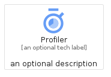
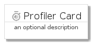
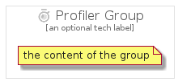

# Profiler


```text
gcp/Item/Profiler
```

```text
include('gcp/Item/Profiler')
```


| Illustration | Profiler | ProfilerCard | ProfilerGroup |
| :---: | :---: | :---: | :---: |
|  |  |  |  |


## Sprites
The item provides the following sriptes:

- `<$ProfilerXs>`
- `<$ProfilerSm>`
- `<$ProfilerMd>`
- `<$ProfilerLg>`


## Profiler

### Load remotely
```plantuml
@startuml
' configures the library
!global $LIB_BASE_LOCATION="https://raw.githubusercontent.com/tmorin/plantuml-libs/master/distribution"

' loads the library's bootstrap
!include $LIB_BASE_LOCATION/bootstrap.puml

' loads the package bootstrap
include('gcp/bootstrap')

' loads the Item which embeds the element Profiler
include('gcp/Item/Profiler')

' renders the element
Profiler('Profiler', 'Profiler', 'an optional tech label', 'an optional description')
@enduml
```

### Load locally
```plantuml
@startuml
' configures the library
!global $INCLUSION_MODE="local"
!global $LIB_BASE_LOCATION="../.."

' loads the library's bootstrap
!include $LIB_BASE_LOCATION/bootstrap.puml

' loads the package bootstrap
include('gcp/bootstrap')

' loads the Item which embeds the element Profiler
include('gcp/Item/Profiler')

' renders the element
Profiler('Profiler', 'Profiler', 'an optional tech label', 'an optional description')
@enduml
```

## ProfilerCard

### Load remotely
```plantuml
@startuml
' configures the library
!global $LIB_BASE_LOCATION="https://raw.githubusercontent.com/tmorin/plantuml-libs/master/distribution"

' loads the library's bootstrap
!include $LIB_BASE_LOCATION/bootstrap.puml

' loads the package bootstrap
include('gcp/bootstrap')

' loads the Item which embeds the element ProfilerCard
include('gcp/Item/Profiler')

' renders the element
ProfilerCard('ProfilerCard', 'Profiler Card', 'an optional description')
@enduml
```

### Load locally
```plantuml
@startuml
' configures the library
!global $INCLUSION_MODE="local"
!global $LIB_BASE_LOCATION="../.."

' loads the library's bootstrap
!include $LIB_BASE_LOCATION/bootstrap.puml

' loads the package bootstrap
include('gcp/bootstrap')

' loads the Item which embeds the element ProfilerCard
include('gcp/Item/Profiler')

' renders the element
ProfilerCard('ProfilerCard', 'Profiler Card', 'an optional description')
@enduml
```

## ProfilerGroup

### Load remotely
```plantuml
@startuml
' configures the library
!global $LIB_BASE_LOCATION="https://raw.githubusercontent.com/tmorin/plantuml-libs/master/distribution"

' loads the library's bootstrap
!include $LIB_BASE_LOCATION/bootstrap.puml

' loads the package bootstrap
include('gcp/bootstrap')

' loads the Item which embeds the element ProfilerGroup
include('gcp/Item/Profiler')

' renders the element
ProfilerGroup('ProfilerGroup', 'Profiler Group', 'an optional tech label') {
    note as note
        the content of the group
    end note
}
@enduml
```

### Load locally
```plantuml
@startuml
' configures the library
!global $INCLUSION_MODE="local"
!global $LIB_BASE_LOCATION="../.."

' loads the library's bootstrap
!include $LIB_BASE_LOCATION/bootstrap.puml

' loads the package bootstrap
include('gcp/bootstrap')

' loads the Item which embeds the element ProfilerGroup
include('gcp/Item/Profiler')

' renders the element
ProfilerGroup('ProfilerGroup', 'Profiler Group', 'an optional tech label') {
    note as note
        the content of the group
    end note
}
@enduml
```

