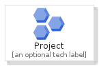
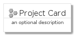

# Project


```text
gcp/Item/Project
```

```text
include('gcp/Item/Project')
```


| Illustration | Project | ProjectCard | ProjectGroup |
| :---: | :---: | :---: | :---: |
|  |  |  |  |


## Project

### Load remotely
```plantuml
@startuml
' configures the library
!global $LIB_BASE_LOCATION="https://raw.githubusercontent.com/tmorin/plantuml-libs/master/distribution"

' loads the library's bootstrap
!include $LIB_BASE_LOCATION/bootstrap.puml

' loads the package bootstrap
include('gcp/bootstrap')

' loads the Item which embeds the element Project
include('gcp/Item/Project')

' renders the element
Project('Project', 'Project', 'an optional tech label')
@enduml
```

### Load locally
```plantuml
@startuml
' configures the library
!global $INCLUSION_MODE="local"
!global $LIB_BASE_LOCATION="../.."

' loads the library's bootstrap
!include $LIB_BASE_LOCATION/bootstrap.puml

' loads the package bootstrap
include('gcp/bootstrap')

' loads the Item which embeds the element Project
include('gcp/Item/Project')

' renders the element
Project('Project', 'Project', 'an optional tech label')
@enduml
```

## ProjectCard

### Load remotely
```plantuml
@startuml
' configures the library
!global $LIB_BASE_LOCATION="https://raw.githubusercontent.com/tmorin/plantuml-libs/master/distribution"

' loads the library's bootstrap
!include $LIB_BASE_LOCATION/bootstrap.puml

' loads the package bootstrap
include('gcp/bootstrap')

' loads the Item which embeds the element ProjectCard
include('gcp/Item/Project')

' renders the element
ProjectCard('ProjectCard', 'Project Card', 'an optional description')
@enduml
```

### Load locally
```plantuml
@startuml
' configures the library
!global $INCLUSION_MODE="local"
!global $LIB_BASE_LOCATION="../.."

' loads the library's bootstrap
!include $LIB_BASE_LOCATION/bootstrap.puml

' loads the package bootstrap
include('gcp/bootstrap')

' loads the Item which embeds the element ProjectCard
include('gcp/Item/Project')

' renders the element
ProjectCard('ProjectCard', 'Project Card', 'an optional description')
@enduml
```

## ProjectGroup

### Load remotely
```plantuml
@startuml
' configures the library
!global $LIB_BASE_LOCATION="https://raw.githubusercontent.com/tmorin/plantuml-libs/master/distribution"

' loads the library's bootstrap
!include $LIB_BASE_LOCATION/bootstrap.puml

' loads the package bootstrap
include('gcp/bootstrap')

' loads the Item which embeds the element ProjectGroup
include('gcp/Item/Project')

' renders the element
ProjectGroup('ProjectGroup', 'Project Group', 'an optional tech label') {
    note as note
        the content of the group
    end note
}
@enduml
```

### Load locally
```plantuml
@startuml
' configures the library
!global $INCLUSION_MODE="local"
!global $LIB_BASE_LOCATION="../.."

' loads the library's bootstrap
!include $LIB_BASE_LOCATION/bootstrap.puml

' loads the package bootstrap
include('gcp/bootstrap')

' loads the Item which embeds the element ProjectGroup
include('gcp/Item/Project')

' renders the element
ProjectGroup('ProjectGroup', 'Project Group', 'an optional tech label') {
    note as note
        the content of the group
    end note
}
@enduml
```

