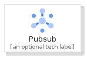
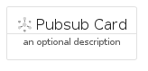
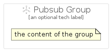

# Pubsub


```text
gcp/Item/Pubsub
```

```text
include('gcp/Item/Pubsub')
```


| Illustration | Pubsub | PubsubCard | PubsubGroup |
| :---: | :---: | :---: | :---: |
|  |  |  |  |


## Sprites
The item provides the following sriptes:

- `<$PubsubXs>`
- `<$PubsubSm>`
- `<$PubsubMd>`
- `<$PubsubLg>`


## Pubsub

### Load remotely
```plantuml
@startuml
' configures the library
!global $LIB_BASE_LOCATION="https://raw.githubusercontent.com/tmorin/plantuml-libs/master/distribution"

' loads the library's bootstrap
!include $LIB_BASE_LOCATION/bootstrap.puml

' loads the package bootstrap
include('gcp/bootstrap')

' loads the Item which embeds the element Pubsub
include('gcp/Item/Pubsub')

' renders the element
Pubsub('Pubsub', 'Pubsub', 'an optional tech label', 'an optional description')
@enduml
```

### Load locally
```plantuml
@startuml
' configures the library
!global $INCLUSION_MODE="local"
!global $LIB_BASE_LOCATION="../.."

' loads the library's bootstrap
!include $LIB_BASE_LOCATION/bootstrap.puml

' loads the package bootstrap
include('gcp/bootstrap')

' loads the Item which embeds the element Pubsub
include('gcp/Item/Pubsub')

' renders the element
Pubsub('Pubsub', 'Pubsub', 'an optional tech label', 'an optional description')
@enduml
```

## PubsubCard

### Load remotely
```plantuml
@startuml
' configures the library
!global $LIB_BASE_LOCATION="https://raw.githubusercontent.com/tmorin/plantuml-libs/master/distribution"

' loads the library's bootstrap
!include $LIB_BASE_LOCATION/bootstrap.puml

' loads the package bootstrap
include('gcp/bootstrap')

' loads the Item which embeds the element PubsubCard
include('gcp/Item/Pubsub')

' renders the element
PubsubCard('PubsubCard', 'Pubsub Card', 'an optional description')
@enduml
```

### Load locally
```plantuml
@startuml
' configures the library
!global $INCLUSION_MODE="local"
!global $LIB_BASE_LOCATION="../.."

' loads the library's bootstrap
!include $LIB_BASE_LOCATION/bootstrap.puml

' loads the package bootstrap
include('gcp/bootstrap')

' loads the Item which embeds the element PubsubCard
include('gcp/Item/Pubsub')

' renders the element
PubsubCard('PubsubCard', 'Pubsub Card', 'an optional description')
@enduml
```

## PubsubGroup

### Load remotely
```plantuml
@startuml
' configures the library
!global $LIB_BASE_LOCATION="https://raw.githubusercontent.com/tmorin/plantuml-libs/master/distribution"

' loads the library's bootstrap
!include $LIB_BASE_LOCATION/bootstrap.puml

' loads the package bootstrap
include('gcp/bootstrap')

' loads the Item which embeds the element PubsubGroup
include('gcp/Item/Pubsub')

' renders the element
PubsubGroup('PubsubGroup', 'Pubsub Group', 'an optional tech label') {
    note as note
        the content of the group
    end note
}
@enduml
```

### Load locally
```plantuml
@startuml
' configures the library
!global $INCLUSION_MODE="local"
!global $LIB_BASE_LOCATION="../.."

' loads the library's bootstrap
!include $LIB_BASE_LOCATION/bootstrap.puml

' loads the package bootstrap
include('gcp/bootstrap')

' loads the Item which embeds the element PubsubGroup
include('gcp/Item/Pubsub')

' renders the element
PubsubGroup('PubsubGroup', 'Pubsub Group', 'an optional tech label') {
    note as note
        the content of the group
    end note
}
@enduml
```

