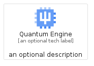
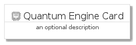
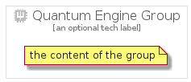

# QuantumEngine


```text
gcp/Item/QuantumEngine
```

```text
include('gcp/Item/QuantumEngine')
```


| Illustration | QuantumEngine | QuantumEngineCard | QuantumEngineGroup |
| :---: | :---: | :---: | :---: |
|  |  |  |  |


## QuantumEngine

### Load remotely
```plantuml
@startuml
' configures the library
!global $LIB_BASE_LOCATION="https://raw.githubusercontent.com/tmorin/plantuml-libs/master/distribution"

' loads the library's bootstrap
!include $LIB_BASE_LOCATION/bootstrap.puml

' loads the package bootstrap
include('gcp/bootstrap')

' loads the Item which embeds the element QuantumEngine
include('gcp/Item/QuantumEngine')

' renders the element
QuantumEngine('QuantumEngine', 'Quantum Engine', 'an optional tech label', 'an optional description')
@enduml
```

### Load locally
```plantuml
@startuml
' configures the library
!global $INCLUSION_MODE="local"
!global $LIB_BASE_LOCATION="../.."

' loads the library's bootstrap
!include $LIB_BASE_LOCATION/bootstrap.puml

' loads the package bootstrap
include('gcp/bootstrap')

' loads the Item which embeds the element QuantumEngine
include('gcp/Item/QuantumEngine')

' renders the element
QuantumEngine('QuantumEngine', 'Quantum Engine', 'an optional tech label', 'an optional description')
@enduml
```

## QuantumEngineCard

### Load remotely
```plantuml
@startuml
' configures the library
!global $LIB_BASE_LOCATION="https://raw.githubusercontent.com/tmorin/plantuml-libs/master/distribution"

' loads the library's bootstrap
!include $LIB_BASE_LOCATION/bootstrap.puml

' loads the package bootstrap
include('gcp/bootstrap')

' loads the Item which embeds the element QuantumEngineCard
include('gcp/Item/QuantumEngine')

' renders the element
QuantumEngineCard('QuantumEngineCard', 'Quantum Engine Card', 'an optional description')
@enduml
```

### Load locally
```plantuml
@startuml
' configures the library
!global $INCLUSION_MODE="local"
!global $LIB_BASE_LOCATION="../.."

' loads the library's bootstrap
!include $LIB_BASE_LOCATION/bootstrap.puml

' loads the package bootstrap
include('gcp/bootstrap')

' loads the Item which embeds the element QuantumEngineCard
include('gcp/Item/QuantumEngine')

' renders the element
QuantumEngineCard('QuantumEngineCard', 'Quantum Engine Card', 'an optional description')
@enduml
```

## QuantumEngineGroup

### Load remotely
```plantuml
@startuml
' configures the library
!global $LIB_BASE_LOCATION="https://raw.githubusercontent.com/tmorin/plantuml-libs/master/distribution"

' loads the library's bootstrap
!include $LIB_BASE_LOCATION/bootstrap.puml

' loads the package bootstrap
include('gcp/bootstrap')

' loads the Item which embeds the element QuantumEngineGroup
include('gcp/Item/QuantumEngine')

' renders the element
QuantumEngineGroup('QuantumEngineGroup', 'Quantum Engine Group', 'an optional tech label') {
    note as note
        the content of the group
    end note
}
@enduml
```

### Load locally
```plantuml
@startuml
' configures the library
!global $INCLUSION_MODE="local"
!global $LIB_BASE_LOCATION="../.."

' loads the library's bootstrap
!include $LIB_BASE_LOCATION/bootstrap.puml

' loads the package bootstrap
include('gcp/bootstrap')

' loads the Item which embeds the element QuantumEngineGroup
include('gcp/Item/QuantumEngine')

' renders the element
QuantumEngineGroup('QuantumEngineGroup', 'Quantum Engine Group', 'an optional tech label') {
    note as note
        the content of the group
    end note
}
@enduml
```

