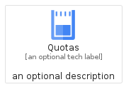
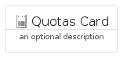
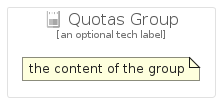

# Quotas


```text
gcp/Item/Quotas
```

```text
include('gcp/Item/Quotas')
```


| Illustration | Quotas | QuotasCard | QuotasGroup |
| :---: | :---: | :---: | :---: |
|  |  |  |  |


## Quotas

### Load remotely
```plantuml
@startuml
' configures the library
!global $LIB_BASE_LOCATION="https://raw.githubusercontent.com/tmorin/plantuml-libs/master/distribution"

' loads the library's bootstrap
!include $LIB_BASE_LOCATION/bootstrap.puml

' loads the package bootstrap
include('gcp/bootstrap')

' loads the Item which embeds the element Quotas
include('gcp/Item/Quotas')

' renders the element
Quotas('Quotas', 'Quotas', 'an optional tech label', 'an optional description')
@enduml
```

### Load locally
```plantuml
@startuml
' configures the library
!global $INCLUSION_MODE="local"
!global $LIB_BASE_LOCATION="../.."

' loads the library's bootstrap
!include $LIB_BASE_LOCATION/bootstrap.puml

' loads the package bootstrap
include('gcp/bootstrap')

' loads the Item which embeds the element Quotas
include('gcp/Item/Quotas')

' renders the element
Quotas('Quotas', 'Quotas', 'an optional tech label', 'an optional description')
@enduml
```

## QuotasCard

### Load remotely
```plantuml
@startuml
' configures the library
!global $LIB_BASE_LOCATION="https://raw.githubusercontent.com/tmorin/plantuml-libs/master/distribution"

' loads the library's bootstrap
!include $LIB_BASE_LOCATION/bootstrap.puml

' loads the package bootstrap
include('gcp/bootstrap')

' loads the Item which embeds the element QuotasCard
include('gcp/Item/Quotas')

' renders the element
QuotasCard('QuotasCard', 'Quotas Card', 'an optional description')
@enduml
```

### Load locally
```plantuml
@startuml
' configures the library
!global $INCLUSION_MODE="local"
!global $LIB_BASE_LOCATION="../.."

' loads the library's bootstrap
!include $LIB_BASE_LOCATION/bootstrap.puml

' loads the package bootstrap
include('gcp/bootstrap')

' loads the Item which embeds the element QuotasCard
include('gcp/Item/Quotas')

' renders the element
QuotasCard('QuotasCard', 'Quotas Card', 'an optional description')
@enduml
```

## QuotasGroup

### Load remotely
```plantuml
@startuml
' configures the library
!global $LIB_BASE_LOCATION="https://raw.githubusercontent.com/tmorin/plantuml-libs/master/distribution"

' loads the library's bootstrap
!include $LIB_BASE_LOCATION/bootstrap.puml

' loads the package bootstrap
include('gcp/bootstrap')

' loads the Item which embeds the element QuotasGroup
include('gcp/Item/Quotas')

' renders the element
QuotasGroup('QuotasGroup', 'Quotas Group', 'an optional tech label') {
    note as note
        the content of the group
    end note
}
@enduml
```

### Load locally
```plantuml
@startuml
' configures the library
!global $INCLUSION_MODE="local"
!global $LIB_BASE_LOCATION="../.."

' loads the library's bootstrap
!include $LIB_BASE_LOCATION/bootstrap.puml

' loads the package bootstrap
include('gcp/bootstrap')

' loads the Item which embeds the element QuotasGroup
include('gcp/Item/Quotas')

' renders the element
QuotasGroup('QuotasGroup', 'Quotas Group', 'an optional tech label') {
    note as note
        the content of the group
    end note
}
@enduml
```

