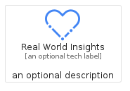
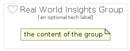

# RealWorldInsights


```text
gcp/Item/RealWorldInsights
```

```text
include('gcp/Item/RealWorldInsights')
```


| Illustration | RealWorldInsights | RealWorldInsightsCard | RealWorldInsightsGroup |
| :---: | :---: | :---: | :---: |
|  |  |  |  |


## RealWorldInsights

### Load remotely
```plantuml
@startuml
' configures the library
!global $LIB_BASE_LOCATION="https://raw.githubusercontent.com/tmorin/plantuml-libs/master/distribution"

' loads the library's bootstrap
!include $LIB_BASE_LOCATION/bootstrap.puml

' loads the package bootstrap
include('gcp/bootstrap')

' loads the Item which embeds the element RealWorldInsights
include('gcp/Item/RealWorldInsights')

' renders the element
RealWorldInsights('RealWorldInsights', 'Real World Insights', 'an optional tech label', 'an optional description')
@enduml
```

### Load locally
```plantuml
@startuml
' configures the library
!global $INCLUSION_MODE="local"
!global $LIB_BASE_LOCATION="../.."

' loads the library's bootstrap
!include $LIB_BASE_LOCATION/bootstrap.puml

' loads the package bootstrap
include('gcp/bootstrap')

' loads the Item which embeds the element RealWorldInsights
include('gcp/Item/RealWorldInsights')

' renders the element
RealWorldInsights('RealWorldInsights', 'Real World Insights', 'an optional tech label', 'an optional description')
@enduml
```

## RealWorldInsightsCard

### Load remotely
```plantuml
@startuml
' configures the library
!global $LIB_BASE_LOCATION="https://raw.githubusercontent.com/tmorin/plantuml-libs/master/distribution"

' loads the library's bootstrap
!include $LIB_BASE_LOCATION/bootstrap.puml

' loads the package bootstrap
include('gcp/bootstrap')

' loads the Item which embeds the element RealWorldInsightsCard
include('gcp/Item/RealWorldInsights')

' renders the element
RealWorldInsightsCard('RealWorldInsightsCard', 'Real World Insights Card', 'an optional description')
@enduml
```

### Load locally
```plantuml
@startuml
' configures the library
!global $INCLUSION_MODE="local"
!global $LIB_BASE_LOCATION="../.."

' loads the library's bootstrap
!include $LIB_BASE_LOCATION/bootstrap.puml

' loads the package bootstrap
include('gcp/bootstrap')

' loads the Item which embeds the element RealWorldInsightsCard
include('gcp/Item/RealWorldInsights')

' renders the element
RealWorldInsightsCard('RealWorldInsightsCard', 'Real World Insights Card', 'an optional description')
@enduml
```

## RealWorldInsightsGroup

### Load remotely
```plantuml
@startuml
' configures the library
!global $LIB_BASE_LOCATION="https://raw.githubusercontent.com/tmorin/plantuml-libs/master/distribution"

' loads the library's bootstrap
!include $LIB_BASE_LOCATION/bootstrap.puml

' loads the package bootstrap
include('gcp/bootstrap')

' loads the Item which embeds the element RealWorldInsightsGroup
include('gcp/Item/RealWorldInsights')

' renders the element
RealWorldInsightsGroup('RealWorldInsightsGroup', 'Real World Insights Group', 'an optional tech label') {
    note as note
        the content of the group
    end note
}
@enduml
```

### Load locally
```plantuml
@startuml
' configures the library
!global $INCLUSION_MODE="local"
!global $LIB_BASE_LOCATION="../.."

' loads the library's bootstrap
!include $LIB_BASE_LOCATION/bootstrap.puml

' loads the package bootstrap
include('gcp/bootstrap')

' loads the Item which embeds the element RealWorldInsightsGroup
include('gcp/Item/RealWorldInsights')

' renders the element
RealWorldInsightsGroup('RealWorldInsightsGroup', 'Real World Insights Group', 'an optional tech label') {
    note as note
        the content of the group
    end note
}
@enduml
```

