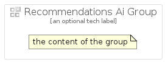

# RecommendationsAi


```text
gcp/Item/RecommendationsAi
```

```text
include('gcp/Item/RecommendationsAi')
```


| Illustration | RecommendationsAi | RecommendationsAiCard | RecommendationsAiGroup |
| :---: | :---: | :---: | :---: |
|  |  |  |  |


## RecommendationsAi

### Load remotely
```plantuml
@startuml
' configures the library
!global $LIB_BASE_LOCATION="https://raw.githubusercontent.com/tmorin/plantuml-libs/master/distribution"

' loads the library's bootstrap
!include $LIB_BASE_LOCATION/bootstrap.puml

' loads the package bootstrap
include('gcp/bootstrap')

' loads the Item which embeds the element RecommendationsAi
include('gcp/Item/RecommendationsAi')

' renders the element
RecommendationsAi('RecommendationsAi', 'Recommendations Ai', 'an optional tech label')
@enduml
```

### Load locally
```plantuml
@startuml
' configures the library
!global $INCLUSION_MODE="local"
!global $LIB_BASE_LOCATION="../.."

' loads the library's bootstrap
!include $LIB_BASE_LOCATION/bootstrap.puml

' loads the package bootstrap
include('gcp/bootstrap')

' loads the Item which embeds the element RecommendationsAi
include('gcp/Item/RecommendationsAi')

' renders the element
RecommendationsAi('RecommendationsAi', 'Recommendations Ai', 'an optional tech label')
@enduml
```

## RecommendationsAiCard

### Load remotely
```plantuml
@startuml
' configures the library
!global $LIB_BASE_LOCATION="https://raw.githubusercontent.com/tmorin/plantuml-libs/master/distribution"

' loads the library's bootstrap
!include $LIB_BASE_LOCATION/bootstrap.puml

' loads the package bootstrap
include('gcp/bootstrap')

' loads the Item which embeds the element RecommendationsAiCard
include('gcp/Item/RecommendationsAi')

' renders the element
RecommendationsAiCard('RecommendationsAiCard', 'Recommendations Ai Card', 'an optional description')
@enduml
```

### Load locally
```plantuml
@startuml
' configures the library
!global $INCLUSION_MODE="local"
!global $LIB_BASE_LOCATION="../.."

' loads the library's bootstrap
!include $LIB_BASE_LOCATION/bootstrap.puml

' loads the package bootstrap
include('gcp/bootstrap')

' loads the Item which embeds the element RecommendationsAiCard
include('gcp/Item/RecommendationsAi')

' renders the element
RecommendationsAiCard('RecommendationsAiCard', 'Recommendations Ai Card', 'an optional description')
@enduml
```

## RecommendationsAiGroup

### Load remotely
```plantuml
@startuml
' configures the library
!global $LIB_BASE_LOCATION="https://raw.githubusercontent.com/tmorin/plantuml-libs/master/distribution"

' loads the library's bootstrap
!include $LIB_BASE_LOCATION/bootstrap.puml

' loads the package bootstrap
include('gcp/bootstrap')

' loads the Item which embeds the element RecommendationsAiGroup
include('gcp/Item/RecommendationsAi')

' renders the element
RecommendationsAiGroup('RecommendationsAiGroup', 'Recommendations Ai Group', 'an optional tech label') {
    note as note
        the content of the group
    end note
}
@enduml
```

### Load locally
```plantuml
@startuml
' configures the library
!global $INCLUSION_MODE="local"
!global $LIB_BASE_LOCATION="../.."

' loads the library's bootstrap
!include $LIB_BASE_LOCATION/bootstrap.puml

' loads the package bootstrap
include('gcp/bootstrap')

' loads the Item which embeds the element RecommendationsAiGroup
include('gcp/Item/RecommendationsAi')

' renders the element
RecommendationsAiGroup('RecommendationsAiGroup', 'Recommendations Ai Group', 'an optional tech label') {
    note as note
        the content of the group
    end note
}
@enduml
```

