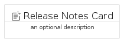
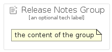

# ReleaseNotes


```text
gcp/Item/ReleaseNotes
```

```text
include('gcp/Item/ReleaseNotes')
```


| Illustration | ReleaseNotes | ReleaseNotesCard | ReleaseNotesGroup |
| :---: | :---: | :---: | :---: |
|  |  |  |  |


## ReleaseNotes

### Load remotely
```plantuml
@startuml
' configures the library
!global $LIB_BASE_LOCATION="https://raw.githubusercontent.com/tmorin/plantuml-libs/master/distribution"

' loads the library's bootstrap
!include $LIB_BASE_LOCATION/bootstrap.puml

' loads the package bootstrap
include('gcp/bootstrap')

' loads the Item which embeds the element ReleaseNotes
include('gcp/Item/ReleaseNotes')

' renders the element
ReleaseNotes('ReleaseNotes', 'Release Notes', 'an optional tech label')
@enduml
```

### Load locally
```plantuml
@startuml
' configures the library
!global $INCLUSION_MODE="local"
!global $LIB_BASE_LOCATION="../.."

' loads the library's bootstrap
!include $LIB_BASE_LOCATION/bootstrap.puml

' loads the package bootstrap
include('gcp/bootstrap')

' loads the Item which embeds the element ReleaseNotes
include('gcp/Item/ReleaseNotes')

' renders the element
ReleaseNotes('ReleaseNotes', 'Release Notes', 'an optional tech label')
@enduml
```

## ReleaseNotesCard

### Load remotely
```plantuml
@startuml
' configures the library
!global $LIB_BASE_LOCATION="https://raw.githubusercontent.com/tmorin/plantuml-libs/master/distribution"

' loads the library's bootstrap
!include $LIB_BASE_LOCATION/bootstrap.puml

' loads the package bootstrap
include('gcp/bootstrap')

' loads the Item which embeds the element ReleaseNotesCard
include('gcp/Item/ReleaseNotes')

' renders the element
ReleaseNotesCard('ReleaseNotesCard', 'Release Notes Card', 'an optional description')
@enduml
```

### Load locally
```plantuml
@startuml
' configures the library
!global $INCLUSION_MODE="local"
!global $LIB_BASE_LOCATION="../.."

' loads the library's bootstrap
!include $LIB_BASE_LOCATION/bootstrap.puml

' loads the package bootstrap
include('gcp/bootstrap')

' loads the Item which embeds the element ReleaseNotesCard
include('gcp/Item/ReleaseNotes')

' renders the element
ReleaseNotesCard('ReleaseNotesCard', 'Release Notes Card', 'an optional description')
@enduml
```

## ReleaseNotesGroup

### Load remotely
```plantuml
@startuml
' configures the library
!global $LIB_BASE_LOCATION="https://raw.githubusercontent.com/tmorin/plantuml-libs/master/distribution"

' loads the library's bootstrap
!include $LIB_BASE_LOCATION/bootstrap.puml

' loads the package bootstrap
include('gcp/bootstrap')

' loads the Item which embeds the element ReleaseNotesGroup
include('gcp/Item/ReleaseNotes')

' renders the element
ReleaseNotesGroup('ReleaseNotesGroup', 'Release Notes Group', 'an optional tech label') {
    note as note
        the content of the group
    end note
}
@enduml
```

### Load locally
```plantuml
@startuml
' configures the library
!global $INCLUSION_MODE="local"
!global $LIB_BASE_LOCATION="../.."

' loads the library's bootstrap
!include $LIB_BASE_LOCATION/bootstrap.puml

' loads the package bootstrap
include('gcp/bootstrap')

' loads the Item which embeds the element ReleaseNotesGroup
include('gcp/Item/ReleaseNotes')

' renders the element
ReleaseNotesGroup('ReleaseNotesGroup', 'Release Notes Group', 'an optional tech label') {
    note as note
        the content of the group
    end note
}
@enduml
```

