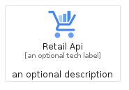
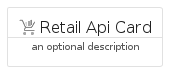
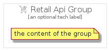

# RetailApi


```text
gcp/Item/RetailApi
```

```text
include('gcp/Item/RetailApi')
```


| Illustration | RetailApi | RetailApiCard | RetailApiGroup |
| :---: | :---: | :---: | :---: |
|  |  |  |  |


## RetailApi

### Load remotely
```plantuml
@startuml
' configures the library
!global $LIB_BASE_LOCATION="https://raw.githubusercontent.com/tmorin/plantuml-libs/master/distribution"

' loads the library's bootstrap
!include $LIB_BASE_LOCATION/bootstrap.puml

' loads the package bootstrap
include('gcp/bootstrap')

' loads the Item which embeds the element RetailApi
include('gcp/Item/RetailApi')

' renders the element
RetailApi('RetailApi', 'Retail Api', 'an optional tech label', 'an optional description')
@enduml
```

### Load locally
```plantuml
@startuml
' configures the library
!global $INCLUSION_MODE="local"
!global $LIB_BASE_LOCATION="../.."

' loads the library's bootstrap
!include $LIB_BASE_LOCATION/bootstrap.puml

' loads the package bootstrap
include('gcp/bootstrap')

' loads the Item which embeds the element RetailApi
include('gcp/Item/RetailApi')

' renders the element
RetailApi('RetailApi', 'Retail Api', 'an optional tech label', 'an optional description')
@enduml
```

## RetailApiCard

### Load remotely
```plantuml
@startuml
' configures the library
!global $LIB_BASE_LOCATION="https://raw.githubusercontent.com/tmorin/plantuml-libs/master/distribution"

' loads the library's bootstrap
!include $LIB_BASE_LOCATION/bootstrap.puml

' loads the package bootstrap
include('gcp/bootstrap')

' loads the Item which embeds the element RetailApiCard
include('gcp/Item/RetailApi')

' renders the element
RetailApiCard('RetailApiCard', 'Retail Api Card', 'an optional description')
@enduml
```

### Load locally
```plantuml
@startuml
' configures the library
!global $INCLUSION_MODE="local"
!global $LIB_BASE_LOCATION="../.."

' loads the library's bootstrap
!include $LIB_BASE_LOCATION/bootstrap.puml

' loads the package bootstrap
include('gcp/bootstrap')

' loads the Item which embeds the element RetailApiCard
include('gcp/Item/RetailApi')

' renders the element
RetailApiCard('RetailApiCard', 'Retail Api Card', 'an optional description')
@enduml
```

## RetailApiGroup

### Load remotely
```plantuml
@startuml
' configures the library
!global $LIB_BASE_LOCATION="https://raw.githubusercontent.com/tmorin/plantuml-libs/master/distribution"

' loads the library's bootstrap
!include $LIB_BASE_LOCATION/bootstrap.puml

' loads the package bootstrap
include('gcp/bootstrap')

' loads the Item which embeds the element RetailApiGroup
include('gcp/Item/RetailApi')

' renders the element
RetailApiGroup('RetailApiGroup', 'Retail Api Group', 'an optional tech label') {
    note as note
        the content of the group
    end note
}
@enduml
```

### Load locally
```plantuml
@startuml
' configures the library
!global $INCLUSION_MODE="local"
!global $LIB_BASE_LOCATION="../.."

' loads the library's bootstrap
!include $LIB_BASE_LOCATION/bootstrap.puml

' loads the package bootstrap
include('gcp/bootstrap')

' loads the Item which embeds the element RetailApiGroup
include('gcp/Item/RetailApi')

' renders the element
RetailApiGroup('RetailApiGroup', 'Retail Api Group', 'an optional tech label') {
    note as note
        the content of the group
    end note
}
@enduml
```

