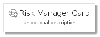

# RiskManager


```text
gcp/Item/RiskManager
```

```text
include('gcp/Item/RiskManager')
```


| Illustration | RiskManager | RiskManagerCard | RiskManagerGroup |
| :---: | :---: | :---: | :---: |
|  |  |  |  |


## RiskManager

### Load remotely
```plantuml
@startuml
' configures the library
!global $LIB_BASE_LOCATION="https://raw.githubusercontent.com/tmorin/plantuml-libs/master/distribution"

' loads the library's bootstrap
!include $LIB_BASE_LOCATION/bootstrap.puml

' loads the package bootstrap
include('gcp/bootstrap')

' loads the Item which embeds the element RiskManager
include('gcp/Item/RiskManager')

' renders the element
RiskManager('RiskManager', 'Risk Manager', 'an optional tech label')
@enduml
```

### Load locally
```plantuml
@startuml
' configures the library
!global $INCLUSION_MODE="local"
!global $LIB_BASE_LOCATION="../.."

' loads the library's bootstrap
!include $LIB_BASE_LOCATION/bootstrap.puml

' loads the package bootstrap
include('gcp/bootstrap')

' loads the Item which embeds the element RiskManager
include('gcp/Item/RiskManager')

' renders the element
RiskManager('RiskManager', 'Risk Manager', 'an optional tech label')
@enduml
```

## RiskManagerCard

### Load remotely
```plantuml
@startuml
' configures the library
!global $LIB_BASE_LOCATION="https://raw.githubusercontent.com/tmorin/plantuml-libs/master/distribution"

' loads the library's bootstrap
!include $LIB_BASE_LOCATION/bootstrap.puml

' loads the package bootstrap
include('gcp/bootstrap')

' loads the Item which embeds the element RiskManagerCard
include('gcp/Item/RiskManager')

' renders the element
RiskManagerCard('RiskManagerCard', 'Risk Manager Card', 'an optional description')
@enduml
```

### Load locally
```plantuml
@startuml
' configures the library
!global $INCLUSION_MODE="local"
!global $LIB_BASE_LOCATION="../.."

' loads the library's bootstrap
!include $LIB_BASE_LOCATION/bootstrap.puml

' loads the package bootstrap
include('gcp/bootstrap')

' loads the Item which embeds the element RiskManagerCard
include('gcp/Item/RiskManager')

' renders the element
RiskManagerCard('RiskManagerCard', 'Risk Manager Card', 'an optional description')
@enduml
```

## RiskManagerGroup

### Load remotely
```plantuml
@startuml
' configures the library
!global $LIB_BASE_LOCATION="https://raw.githubusercontent.com/tmorin/plantuml-libs/master/distribution"

' loads the library's bootstrap
!include $LIB_BASE_LOCATION/bootstrap.puml

' loads the package bootstrap
include('gcp/bootstrap')

' loads the Item which embeds the element RiskManagerGroup
include('gcp/Item/RiskManager')

' renders the element
RiskManagerGroup('RiskManagerGroup', 'Risk Manager Group', 'an optional tech label') {
    note as note
        the content of the group
    end note
}
@enduml
```

### Load locally
```plantuml
@startuml
' configures the library
!global $INCLUSION_MODE="local"
!global $LIB_BASE_LOCATION="../.."

' loads the library's bootstrap
!include $LIB_BASE_LOCATION/bootstrap.puml

' loads the package bootstrap
include('gcp/bootstrap')

' loads the Item which embeds the element RiskManagerGroup
include('gcp/Item/RiskManager')

' renders the element
RiskManagerGroup('RiskManagerGroup', 'Risk Manager Group', 'an optional tech label') {
    note as note
        the content of the group
    end note
}
@enduml
```

