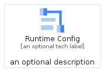
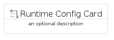

# RuntimeConfig


```text
gcp/Item/RuntimeConfig
```

```text
include('gcp/Item/RuntimeConfig')
```


| Illustration | RuntimeConfig | RuntimeConfigCard | RuntimeConfigGroup |
| :---: | :---: | :---: | :---: |
|  |  |  |  |


## RuntimeConfig

### Load remotely
```plantuml
@startuml
' configures the library
!global $LIB_BASE_LOCATION="https://raw.githubusercontent.com/tmorin/plantuml-libs/master/distribution"

' loads the library's bootstrap
!include $LIB_BASE_LOCATION/bootstrap.puml

' loads the package bootstrap
include('gcp/bootstrap')

' loads the Item which embeds the element RuntimeConfig
include('gcp/Item/RuntimeConfig')

' renders the element
RuntimeConfig('RuntimeConfig', 'Runtime Config', 'an optional tech label', 'an optional description')
@enduml
```

### Load locally
```plantuml
@startuml
' configures the library
!global $INCLUSION_MODE="local"
!global $LIB_BASE_LOCATION="../.."

' loads the library's bootstrap
!include $LIB_BASE_LOCATION/bootstrap.puml

' loads the package bootstrap
include('gcp/bootstrap')

' loads the Item which embeds the element RuntimeConfig
include('gcp/Item/RuntimeConfig')

' renders the element
RuntimeConfig('RuntimeConfig', 'Runtime Config', 'an optional tech label', 'an optional description')
@enduml
```

## RuntimeConfigCard

### Load remotely
```plantuml
@startuml
' configures the library
!global $LIB_BASE_LOCATION="https://raw.githubusercontent.com/tmorin/plantuml-libs/master/distribution"

' loads the library's bootstrap
!include $LIB_BASE_LOCATION/bootstrap.puml

' loads the package bootstrap
include('gcp/bootstrap')

' loads the Item which embeds the element RuntimeConfigCard
include('gcp/Item/RuntimeConfig')

' renders the element
RuntimeConfigCard('RuntimeConfigCard', 'Runtime Config Card', 'an optional description')
@enduml
```

### Load locally
```plantuml
@startuml
' configures the library
!global $INCLUSION_MODE="local"
!global $LIB_BASE_LOCATION="../.."

' loads the library's bootstrap
!include $LIB_BASE_LOCATION/bootstrap.puml

' loads the package bootstrap
include('gcp/bootstrap')

' loads the Item which embeds the element RuntimeConfigCard
include('gcp/Item/RuntimeConfig')

' renders the element
RuntimeConfigCard('RuntimeConfigCard', 'Runtime Config Card', 'an optional description')
@enduml
```

## RuntimeConfigGroup

### Load remotely
```plantuml
@startuml
' configures the library
!global $LIB_BASE_LOCATION="https://raw.githubusercontent.com/tmorin/plantuml-libs/master/distribution"

' loads the library's bootstrap
!include $LIB_BASE_LOCATION/bootstrap.puml

' loads the package bootstrap
include('gcp/bootstrap')

' loads the Item which embeds the element RuntimeConfigGroup
include('gcp/Item/RuntimeConfig')

' renders the element
RuntimeConfigGroup('RuntimeConfigGroup', 'Runtime Config Group', 'an optional tech label') {
    note as note
        the content of the group
    end note
}
@enduml
```

### Load locally
```plantuml
@startuml
' configures the library
!global $INCLUSION_MODE="local"
!global $LIB_BASE_LOCATION="../.."

' loads the library's bootstrap
!include $LIB_BASE_LOCATION/bootstrap.puml

' loads the package bootstrap
include('gcp/bootstrap')

' loads the Item which embeds the element RuntimeConfigGroup
include('gcp/Item/RuntimeConfig')

' renders the element
RuntimeConfigGroup('RuntimeConfigGroup', 'Runtime Config Group', 'an optional tech label') {
    note as note
        the content of the group
    end note
}
@enduml
```

