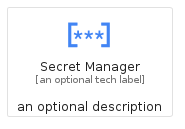
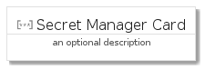
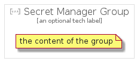

# SecretManager


```text
gcp/Item/SecretManager
```

```text
include('gcp/Item/SecretManager')
```


| Illustration | SecretManager | SecretManagerCard | SecretManagerGroup |
| :---: | :---: | :---: | :---: |
|  |  |  |  |


## SecretManager

### Load remotely
```plantuml
@startuml
' configures the library
!global $LIB_BASE_LOCATION="https://raw.githubusercontent.com/tmorin/plantuml-libs/master/distribution"

' loads the library's bootstrap
!include $LIB_BASE_LOCATION/bootstrap.puml

' loads the package bootstrap
include('gcp/bootstrap')

' loads the Item which embeds the element SecretManager
include('gcp/Item/SecretManager')

' renders the element
SecretManager('SecretManager', 'Secret Manager', 'an optional tech label')
@enduml
```

### Load locally
```plantuml
@startuml
' configures the library
!global $INCLUSION_MODE="local"
!global $LIB_BASE_LOCATION="../.."

' loads the library's bootstrap
!include $LIB_BASE_LOCATION/bootstrap.puml

' loads the package bootstrap
include('gcp/bootstrap')

' loads the Item which embeds the element SecretManager
include('gcp/Item/SecretManager')

' renders the element
SecretManager('SecretManager', 'Secret Manager', 'an optional tech label')
@enduml
```

## SecretManagerCard

### Load remotely
```plantuml
@startuml
' configures the library
!global $LIB_BASE_LOCATION="https://raw.githubusercontent.com/tmorin/plantuml-libs/master/distribution"

' loads the library's bootstrap
!include $LIB_BASE_LOCATION/bootstrap.puml

' loads the package bootstrap
include('gcp/bootstrap')

' loads the Item which embeds the element SecretManagerCard
include('gcp/Item/SecretManager')

' renders the element
SecretManagerCard('SecretManagerCard', 'Secret Manager Card', 'an optional description')
@enduml
```

### Load locally
```plantuml
@startuml
' configures the library
!global $INCLUSION_MODE="local"
!global $LIB_BASE_LOCATION="../.."

' loads the library's bootstrap
!include $LIB_BASE_LOCATION/bootstrap.puml

' loads the package bootstrap
include('gcp/bootstrap')

' loads the Item which embeds the element SecretManagerCard
include('gcp/Item/SecretManager')

' renders the element
SecretManagerCard('SecretManagerCard', 'Secret Manager Card', 'an optional description')
@enduml
```

## SecretManagerGroup

### Load remotely
```plantuml
@startuml
' configures the library
!global $LIB_BASE_LOCATION="https://raw.githubusercontent.com/tmorin/plantuml-libs/master/distribution"

' loads the library's bootstrap
!include $LIB_BASE_LOCATION/bootstrap.puml

' loads the package bootstrap
include('gcp/bootstrap')

' loads the Item which embeds the element SecretManagerGroup
include('gcp/Item/SecretManager')

' renders the element
SecretManagerGroup('SecretManagerGroup', 'Secret Manager Group', 'an optional tech label') {
    note as note
        the content of the group
    end note
}
@enduml
```

### Load locally
```plantuml
@startuml
' configures the library
!global $INCLUSION_MODE="local"
!global $LIB_BASE_LOCATION="../.."

' loads the library's bootstrap
!include $LIB_BASE_LOCATION/bootstrap.puml

' loads the package bootstrap
include('gcp/bootstrap')

' loads the Item which embeds the element SecretManagerGroup
include('gcp/Item/SecretManager')

' renders the element
SecretManagerGroup('SecretManagerGroup', 'Secret Manager Group', 'an optional tech label') {
    note as note
        the content of the group
    end note
}
@enduml
```

