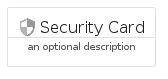
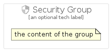

# Security


```text
gcp/Item/Security
```

```text
include('gcp/Item/Security')
```


| Illustration | Security | SecurityCard | SecurityGroup |
| :---: | :---: | :---: | :---: |
|  |  |  |  |


## Security

### Load remotely
```plantuml
@startuml
' configures the library
!global $LIB_BASE_LOCATION="https://raw.githubusercontent.com/tmorin/plantuml-libs/master/distribution"

' loads the library's bootstrap
!include $LIB_BASE_LOCATION/bootstrap.puml

' loads the package bootstrap
include('gcp/bootstrap')

' loads the Item which embeds the element Security
include('gcp/Item/Security')

' renders the element
Security('Security', 'Security', 'an optional tech label', 'an optional description')
@enduml
```

### Load locally
```plantuml
@startuml
' configures the library
!global $INCLUSION_MODE="local"
!global $LIB_BASE_LOCATION="../.."

' loads the library's bootstrap
!include $LIB_BASE_LOCATION/bootstrap.puml

' loads the package bootstrap
include('gcp/bootstrap')

' loads the Item which embeds the element Security
include('gcp/Item/Security')

' renders the element
Security('Security', 'Security', 'an optional tech label', 'an optional description')
@enduml
```

## SecurityCard

### Load remotely
```plantuml
@startuml
' configures the library
!global $LIB_BASE_LOCATION="https://raw.githubusercontent.com/tmorin/plantuml-libs/master/distribution"

' loads the library's bootstrap
!include $LIB_BASE_LOCATION/bootstrap.puml

' loads the package bootstrap
include('gcp/bootstrap')

' loads the Item which embeds the element SecurityCard
include('gcp/Item/Security')

' renders the element
SecurityCard('SecurityCard', 'Security Card', 'an optional description')
@enduml
```

### Load locally
```plantuml
@startuml
' configures the library
!global $INCLUSION_MODE="local"
!global $LIB_BASE_LOCATION="../.."

' loads the library's bootstrap
!include $LIB_BASE_LOCATION/bootstrap.puml

' loads the package bootstrap
include('gcp/bootstrap')

' loads the Item which embeds the element SecurityCard
include('gcp/Item/Security')

' renders the element
SecurityCard('SecurityCard', 'Security Card', 'an optional description')
@enduml
```

## SecurityGroup

### Load remotely
```plantuml
@startuml
' configures the library
!global $LIB_BASE_LOCATION="https://raw.githubusercontent.com/tmorin/plantuml-libs/master/distribution"

' loads the library's bootstrap
!include $LIB_BASE_LOCATION/bootstrap.puml

' loads the package bootstrap
include('gcp/bootstrap')

' loads the Item which embeds the element SecurityGroup
include('gcp/Item/Security')

' renders the element
SecurityGroup('SecurityGroup', 'Security Group', 'an optional tech label') {
    note as note
        the content of the group
    end note
}
@enduml
```

### Load locally
```plantuml
@startuml
' configures the library
!global $INCLUSION_MODE="local"
!global $LIB_BASE_LOCATION="../.."

' loads the library's bootstrap
!include $LIB_BASE_LOCATION/bootstrap.puml

' loads the package bootstrap
include('gcp/bootstrap')

' loads the Item which embeds the element SecurityGroup
include('gcp/Item/Security')

' renders the element
SecurityGroup('SecurityGroup', 'Security Group', 'an optional tech label') {
    note as note
        the content of the group
    end note
}
@enduml
```

