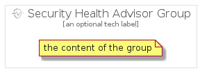

# SecurityHealthAdvisor


```text
gcp/Item/SecurityHealthAdvisor
```

```text
include('gcp/Item/SecurityHealthAdvisor')
```


| Illustration | SecurityHealthAdvisor | SecurityHealthAdvisorCard | SecurityHealthAdvisorGroup |
| :---: | :---: | :---: | :---: |
|  |  |  |  |


## SecurityHealthAdvisor

### Load remotely
```plantuml
@startuml
' configures the library
!global $LIB_BASE_LOCATION="https://raw.githubusercontent.com/tmorin/plantuml-libs/master/distribution"

' loads the library's bootstrap
!include $LIB_BASE_LOCATION/bootstrap.puml

' loads the package bootstrap
include('gcp/bootstrap')

' loads the Item which embeds the element SecurityHealthAdvisor
include('gcp/Item/SecurityHealthAdvisor')

' renders the element
SecurityHealthAdvisor('SecurityHealthAdvisor', 'Security Health Advisor', 'an optional tech label')
@enduml
```

### Load locally
```plantuml
@startuml
' configures the library
!global $INCLUSION_MODE="local"
!global $LIB_BASE_LOCATION="../.."

' loads the library's bootstrap
!include $LIB_BASE_LOCATION/bootstrap.puml

' loads the package bootstrap
include('gcp/bootstrap')

' loads the Item which embeds the element SecurityHealthAdvisor
include('gcp/Item/SecurityHealthAdvisor')

' renders the element
SecurityHealthAdvisor('SecurityHealthAdvisor', 'Security Health Advisor', 'an optional tech label')
@enduml
```

## SecurityHealthAdvisorCard

### Load remotely
```plantuml
@startuml
' configures the library
!global $LIB_BASE_LOCATION="https://raw.githubusercontent.com/tmorin/plantuml-libs/master/distribution"

' loads the library's bootstrap
!include $LIB_BASE_LOCATION/bootstrap.puml

' loads the package bootstrap
include('gcp/bootstrap')

' loads the Item which embeds the element SecurityHealthAdvisorCard
include('gcp/Item/SecurityHealthAdvisor')

' renders the element
SecurityHealthAdvisorCard('SecurityHealthAdvisorCard', 'Security Health Advisor Card', 'an optional description')
@enduml
```

### Load locally
```plantuml
@startuml
' configures the library
!global $INCLUSION_MODE="local"
!global $LIB_BASE_LOCATION="../.."

' loads the library's bootstrap
!include $LIB_BASE_LOCATION/bootstrap.puml

' loads the package bootstrap
include('gcp/bootstrap')

' loads the Item which embeds the element SecurityHealthAdvisorCard
include('gcp/Item/SecurityHealthAdvisor')

' renders the element
SecurityHealthAdvisorCard('SecurityHealthAdvisorCard', 'Security Health Advisor Card', 'an optional description')
@enduml
```

## SecurityHealthAdvisorGroup

### Load remotely
```plantuml
@startuml
' configures the library
!global $LIB_BASE_LOCATION="https://raw.githubusercontent.com/tmorin/plantuml-libs/master/distribution"

' loads the library's bootstrap
!include $LIB_BASE_LOCATION/bootstrap.puml

' loads the package bootstrap
include('gcp/bootstrap')

' loads the Item which embeds the element SecurityHealthAdvisorGroup
include('gcp/Item/SecurityHealthAdvisor')

' renders the element
SecurityHealthAdvisorGroup('SecurityHealthAdvisorGroup', 'Security Health Advisor Group', 'an optional tech label') {
    note as note
        the content of the group
    end note
}
@enduml
```

### Load locally
```plantuml
@startuml
' configures the library
!global $INCLUSION_MODE="local"
!global $LIB_BASE_LOCATION="../.."

' loads the library's bootstrap
!include $LIB_BASE_LOCATION/bootstrap.puml

' loads the package bootstrap
include('gcp/bootstrap')

' loads the Item which embeds the element SecurityHealthAdvisorGroup
include('gcp/Item/SecurityHealthAdvisor')

' renders the element
SecurityHealthAdvisorGroup('SecurityHealthAdvisorGroup', 'Security Health Advisor Group', 'an optional tech label') {
    note as note
        the content of the group
    end note
}
@enduml
```

