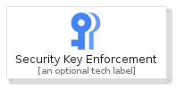
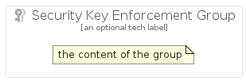

# SecurityKeyEnforcement


```text
gcp/Item/SecurityKeyEnforcement
```

```text
include('gcp/Item/SecurityKeyEnforcement')
```


| Illustration | SecurityKeyEnforcement | SecurityKeyEnforcementCard | SecurityKeyEnforcementGroup |
| :---: | :---: | :---: | :---: |
|  |  |  |  |


## SecurityKeyEnforcement

### Load remotely
```plantuml
@startuml
' configures the library
!global $LIB_BASE_LOCATION="https://raw.githubusercontent.com/tmorin/plantuml-libs/master/distribution"

' loads the library's bootstrap
!include $LIB_BASE_LOCATION/bootstrap.puml

' loads the package bootstrap
include('gcp/bootstrap')

' loads the Item which embeds the element SecurityKeyEnforcement
include('gcp/Item/SecurityKeyEnforcement')

' renders the element
SecurityKeyEnforcement('SecurityKeyEnforcement', 'Security Key Enforcement', 'an optional tech label')
@enduml
```

### Load locally
```plantuml
@startuml
' configures the library
!global $INCLUSION_MODE="local"
!global $LIB_BASE_LOCATION="../.."

' loads the library's bootstrap
!include $LIB_BASE_LOCATION/bootstrap.puml

' loads the package bootstrap
include('gcp/bootstrap')

' loads the Item which embeds the element SecurityKeyEnforcement
include('gcp/Item/SecurityKeyEnforcement')

' renders the element
SecurityKeyEnforcement('SecurityKeyEnforcement', 'Security Key Enforcement', 'an optional tech label')
@enduml
```

## SecurityKeyEnforcementCard

### Load remotely
```plantuml
@startuml
' configures the library
!global $LIB_BASE_LOCATION="https://raw.githubusercontent.com/tmorin/plantuml-libs/master/distribution"

' loads the library's bootstrap
!include $LIB_BASE_LOCATION/bootstrap.puml

' loads the package bootstrap
include('gcp/bootstrap')

' loads the Item which embeds the element SecurityKeyEnforcementCard
include('gcp/Item/SecurityKeyEnforcement')

' renders the element
SecurityKeyEnforcementCard('SecurityKeyEnforcementCard', 'Security Key Enforcement Card', 'an optional description')
@enduml
```

### Load locally
```plantuml
@startuml
' configures the library
!global $INCLUSION_MODE="local"
!global $LIB_BASE_LOCATION="../.."

' loads the library's bootstrap
!include $LIB_BASE_LOCATION/bootstrap.puml

' loads the package bootstrap
include('gcp/bootstrap')

' loads the Item which embeds the element SecurityKeyEnforcementCard
include('gcp/Item/SecurityKeyEnforcement')

' renders the element
SecurityKeyEnforcementCard('SecurityKeyEnforcementCard', 'Security Key Enforcement Card', 'an optional description')
@enduml
```

## SecurityKeyEnforcementGroup

### Load remotely
```plantuml
@startuml
' configures the library
!global $LIB_BASE_LOCATION="https://raw.githubusercontent.com/tmorin/plantuml-libs/master/distribution"

' loads the library's bootstrap
!include $LIB_BASE_LOCATION/bootstrap.puml

' loads the package bootstrap
include('gcp/bootstrap')

' loads the Item which embeds the element SecurityKeyEnforcementGroup
include('gcp/Item/SecurityKeyEnforcement')

' renders the element
SecurityKeyEnforcementGroup('SecurityKeyEnforcementGroup', 'Security Key Enforcement Group', 'an optional tech label') {
    note as note
        the content of the group
    end note
}
@enduml
```

### Load locally
```plantuml
@startuml
' configures the library
!global $INCLUSION_MODE="local"
!global $LIB_BASE_LOCATION="../.."

' loads the library's bootstrap
!include $LIB_BASE_LOCATION/bootstrap.puml

' loads the package bootstrap
include('gcp/bootstrap')

' loads the Item which embeds the element SecurityKeyEnforcementGroup
include('gcp/Item/SecurityKeyEnforcement')

' renders the element
SecurityKeyEnforcementGroup('SecurityKeyEnforcementGroup', 'Security Key Enforcement Group', 'an optional tech label') {
    note as note
        the content of the group
    end note
}
@enduml
```

