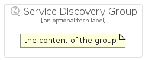

# ServiceDiscovery


```text
gcp/Item/ServiceDiscovery
```

```text
include('gcp/Item/ServiceDiscovery')
```


| Illustration | ServiceDiscovery | ServiceDiscoveryCard | ServiceDiscoveryGroup |
| :---: | :---: | :---: | :---: |
|  |  |  |  |


## ServiceDiscovery

### Load remotely
```plantuml
@startuml
' configures the library
!global $LIB_BASE_LOCATION="https://raw.githubusercontent.com/tmorin/plantuml-libs/master/distribution"

' loads the library's bootstrap
!include $LIB_BASE_LOCATION/bootstrap.puml

' loads the package bootstrap
include('gcp/bootstrap')

' loads the Item which embeds the element ServiceDiscovery
include('gcp/Item/ServiceDiscovery')

' renders the element
ServiceDiscovery('ServiceDiscovery', 'Service Discovery', 'an optional tech label', 'an optional description')
@enduml
```

### Load locally
```plantuml
@startuml
' configures the library
!global $INCLUSION_MODE="local"
!global $LIB_BASE_LOCATION="../.."

' loads the library's bootstrap
!include $LIB_BASE_LOCATION/bootstrap.puml

' loads the package bootstrap
include('gcp/bootstrap')

' loads the Item which embeds the element ServiceDiscovery
include('gcp/Item/ServiceDiscovery')

' renders the element
ServiceDiscovery('ServiceDiscovery', 'Service Discovery', 'an optional tech label', 'an optional description')
@enduml
```

## ServiceDiscoveryCard

### Load remotely
```plantuml
@startuml
' configures the library
!global $LIB_BASE_LOCATION="https://raw.githubusercontent.com/tmorin/plantuml-libs/master/distribution"

' loads the library's bootstrap
!include $LIB_BASE_LOCATION/bootstrap.puml

' loads the package bootstrap
include('gcp/bootstrap')

' loads the Item which embeds the element ServiceDiscoveryCard
include('gcp/Item/ServiceDiscovery')

' renders the element
ServiceDiscoveryCard('ServiceDiscoveryCard', 'Service Discovery Card', 'an optional description')
@enduml
```

### Load locally
```plantuml
@startuml
' configures the library
!global $INCLUSION_MODE="local"
!global $LIB_BASE_LOCATION="../.."

' loads the library's bootstrap
!include $LIB_BASE_LOCATION/bootstrap.puml

' loads the package bootstrap
include('gcp/bootstrap')

' loads the Item which embeds the element ServiceDiscoveryCard
include('gcp/Item/ServiceDiscovery')

' renders the element
ServiceDiscoveryCard('ServiceDiscoveryCard', 'Service Discovery Card', 'an optional description')
@enduml
```

## ServiceDiscoveryGroup

### Load remotely
```plantuml
@startuml
' configures the library
!global $LIB_BASE_LOCATION="https://raw.githubusercontent.com/tmorin/plantuml-libs/master/distribution"

' loads the library's bootstrap
!include $LIB_BASE_LOCATION/bootstrap.puml

' loads the package bootstrap
include('gcp/bootstrap')

' loads the Item which embeds the element ServiceDiscoveryGroup
include('gcp/Item/ServiceDiscovery')

' renders the element
ServiceDiscoveryGroup('ServiceDiscoveryGroup', 'Service Discovery Group', 'an optional tech label') {
    note as note
        the content of the group
    end note
}
@enduml
```

### Load locally
```plantuml
@startuml
' configures the library
!global $INCLUSION_MODE="local"
!global $LIB_BASE_LOCATION="../.."

' loads the library's bootstrap
!include $LIB_BASE_LOCATION/bootstrap.puml

' loads the package bootstrap
include('gcp/bootstrap')

' loads the Item which embeds the element ServiceDiscoveryGroup
include('gcp/Item/ServiceDiscovery')

' renders the element
ServiceDiscoveryGroup('ServiceDiscoveryGroup', 'Service Discovery Group', 'an optional tech label') {
    note as note
        the content of the group
    end note
}
@enduml
```

