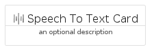
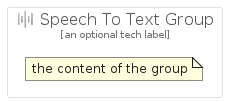

# SpeechToText


```text
gcp/Item/SpeechToText
```

```text
include('gcp/Item/SpeechToText')
```


| Illustration | SpeechToText | SpeechToTextCard | SpeechToTextGroup |
| :---: | :---: | :---: | :---: |
|  |  |  |  |


## Sprites
The item provides the following sriptes:

- `<$SpeechToTextXs>`
- `<$SpeechToTextSm>`
- `<$SpeechToTextMd>`
- `<$SpeechToTextLg>`


## SpeechToText

### Load remotely
```plantuml
@startuml
' configures the library
!global $LIB_BASE_LOCATION="https://raw.githubusercontent.com/tmorin/plantuml-libs/master/distribution"

' loads the library's bootstrap
!include $LIB_BASE_LOCATION/bootstrap.puml

' loads the package bootstrap
include('gcp/bootstrap')

' loads the Item which embeds the element SpeechToText
include('gcp/Item/SpeechToText')

' renders the element
SpeechToText('SpeechToText', 'Speech To Text', 'an optional tech label', 'an optional description')
@enduml
```

### Load locally
```plantuml
@startuml
' configures the library
!global $INCLUSION_MODE="local"
!global $LIB_BASE_LOCATION="../.."

' loads the library's bootstrap
!include $LIB_BASE_LOCATION/bootstrap.puml

' loads the package bootstrap
include('gcp/bootstrap')

' loads the Item which embeds the element SpeechToText
include('gcp/Item/SpeechToText')

' renders the element
SpeechToText('SpeechToText', 'Speech To Text', 'an optional tech label', 'an optional description')
@enduml
```

## SpeechToTextCard

### Load remotely
```plantuml
@startuml
' configures the library
!global $LIB_BASE_LOCATION="https://raw.githubusercontent.com/tmorin/plantuml-libs/master/distribution"

' loads the library's bootstrap
!include $LIB_BASE_LOCATION/bootstrap.puml

' loads the package bootstrap
include('gcp/bootstrap')

' loads the Item which embeds the element SpeechToTextCard
include('gcp/Item/SpeechToText')

' renders the element
SpeechToTextCard('SpeechToTextCard', 'Speech To Text Card', 'an optional description')
@enduml
```

### Load locally
```plantuml
@startuml
' configures the library
!global $INCLUSION_MODE="local"
!global $LIB_BASE_LOCATION="../.."

' loads the library's bootstrap
!include $LIB_BASE_LOCATION/bootstrap.puml

' loads the package bootstrap
include('gcp/bootstrap')

' loads the Item which embeds the element SpeechToTextCard
include('gcp/Item/SpeechToText')

' renders the element
SpeechToTextCard('SpeechToTextCard', 'Speech To Text Card', 'an optional description')
@enduml
```

## SpeechToTextGroup

### Load remotely
```plantuml
@startuml
' configures the library
!global $LIB_BASE_LOCATION="https://raw.githubusercontent.com/tmorin/plantuml-libs/master/distribution"

' loads the library's bootstrap
!include $LIB_BASE_LOCATION/bootstrap.puml

' loads the package bootstrap
include('gcp/bootstrap')

' loads the Item which embeds the element SpeechToTextGroup
include('gcp/Item/SpeechToText')

' renders the element
SpeechToTextGroup('SpeechToTextGroup', 'Speech To Text Group', 'an optional tech label') {
    note as note
        the content of the group
    end note
}
@enduml
```

### Load locally
```plantuml
@startuml
' configures the library
!global $INCLUSION_MODE="local"
!global $LIB_BASE_LOCATION="../.."

' loads the library's bootstrap
!include $LIB_BASE_LOCATION/bootstrap.puml

' loads the package bootstrap
include('gcp/bootstrap')

' loads the Item which embeds the element SpeechToTextGroup
include('gcp/Item/SpeechToText')

' renders the element
SpeechToTextGroup('SpeechToTextGroup', 'Speech To Text Group', 'an optional tech label') {
    note as note
        the content of the group
    end note
}
@enduml
```

