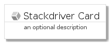
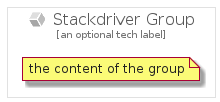

# Stackdriver


```text
gcp/Item/Stackdriver
```

```text
include('gcp/Item/Stackdriver')
```


| Illustration | Stackdriver | StackdriverCard | StackdriverGroup |
| :---: | :---: | :---: | :---: |
|  |  |  |  |


## Sprites
The item provides the following sriptes:

- `<$StackdriverXs>`
- `<$StackdriverSm>`
- `<$StackdriverMd>`
- `<$StackdriverLg>`


## Stackdriver

### Load remotely
```plantuml
@startuml
' configures the library
!global $LIB_BASE_LOCATION="https://raw.githubusercontent.com/tmorin/plantuml-libs/master/distribution"

' loads the library's bootstrap
!include $LIB_BASE_LOCATION/bootstrap.puml

' loads the package bootstrap
include('gcp/bootstrap')

' loads the Item which embeds the element Stackdriver
include('gcp/Item/Stackdriver')

' renders the element
Stackdriver('Stackdriver', 'Stackdriver', 'an optional tech label', 'an optional description')
@enduml
```

### Load locally
```plantuml
@startuml
' configures the library
!global $INCLUSION_MODE="local"
!global $LIB_BASE_LOCATION="../.."

' loads the library's bootstrap
!include $LIB_BASE_LOCATION/bootstrap.puml

' loads the package bootstrap
include('gcp/bootstrap')

' loads the Item which embeds the element Stackdriver
include('gcp/Item/Stackdriver')

' renders the element
Stackdriver('Stackdriver', 'Stackdriver', 'an optional tech label', 'an optional description')
@enduml
```

## StackdriverCard

### Load remotely
```plantuml
@startuml
' configures the library
!global $LIB_BASE_LOCATION="https://raw.githubusercontent.com/tmorin/plantuml-libs/master/distribution"

' loads the library's bootstrap
!include $LIB_BASE_LOCATION/bootstrap.puml

' loads the package bootstrap
include('gcp/bootstrap')

' loads the Item which embeds the element StackdriverCard
include('gcp/Item/Stackdriver')

' renders the element
StackdriverCard('StackdriverCard', 'Stackdriver Card', 'an optional description')
@enduml
```

### Load locally
```plantuml
@startuml
' configures the library
!global $INCLUSION_MODE="local"
!global $LIB_BASE_LOCATION="../.."

' loads the library's bootstrap
!include $LIB_BASE_LOCATION/bootstrap.puml

' loads the package bootstrap
include('gcp/bootstrap')

' loads the Item which embeds the element StackdriverCard
include('gcp/Item/Stackdriver')

' renders the element
StackdriverCard('StackdriverCard', 'Stackdriver Card', 'an optional description')
@enduml
```

## StackdriverGroup

### Load remotely
```plantuml
@startuml
' configures the library
!global $LIB_BASE_LOCATION="https://raw.githubusercontent.com/tmorin/plantuml-libs/master/distribution"

' loads the library's bootstrap
!include $LIB_BASE_LOCATION/bootstrap.puml

' loads the package bootstrap
include('gcp/bootstrap')

' loads the Item which embeds the element StackdriverGroup
include('gcp/Item/Stackdriver')

' renders the element
StackdriverGroup('StackdriverGroup', 'Stackdriver Group', 'an optional tech label') {
    note as note
        the content of the group
    end note
}
@enduml
```

### Load locally
```plantuml
@startuml
' configures the library
!global $INCLUSION_MODE="local"
!global $LIB_BASE_LOCATION="../.."

' loads the library's bootstrap
!include $LIB_BASE_LOCATION/bootstrap.puml

' loads the package bootstrap
include('gcp/bootstrap')

' loads the Item which embeds the element StackdriverGroup
include('gcp/Item/Stackdriver')

' renders the element
StackdriverGroup('StackdriverGroup', 'Stackdriver Group', 'an optional tech label') {
    note as note
        the content of the group
    end note
}
@enduml
```

