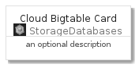
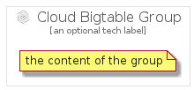

# CloudBigtable


```text
gcp/Item/StorageDatabases/CloudBigtable
```

```text
include('gcp/Item/StorageDatabases/CloudBigtable')
```


| Illustration | CloudBigtable | CloudBigtableCard | CloudBigtableGroup |
| :---: | :---: | :---: | :---: |
|  |  |  |  |


## CloudBigtable

### Load remotely
```plantuml
@startuml
' configures the library
!global $LIB_BASE_LOCATION="https://github.com/tmorin/plantuml-libs/distribution"

' loads the library's bootstrap
!include $LIB_BASE_LOCATION/bootstrap.puml

' loads the package bootstrap
include('gcp/bootstrap')

' loads the Item which embeds the element CloudBigtable
include('gcp/Item/StorageDatabases/CloudBigtable')

' renders the element
CloudBigtable('CloudBigtable', 'Cloud Bigtable', 'an optional tech label')
@enduml
```

### Load locally
```plantuml
@startuml
' configures the library
!global $INCLUSION_MODE="local"
!global $LIB_BASE_LOCATION="../../.."

' loads the library's bootstrap
!include $LIB_BASE_LOCATION/bootstrap.puml

' loads the package bootstrap
include('gcp/bootstrap')

' loads the Item which embeds the element CloudBigtable
include('gcp/Item/StorageDatabases/CloudBigtable')

' renders the element
CloudBigtable('CloudBigtable', 'Cloud Bigtable', 'an optional tech label')
@enduml
```

## CloudBigtableCard

### Load remotely
```plantuml
@startuml
' configures the library
!global $LIB_BASE_LOCATION="https://github.com/tmorin/plantuml-libs/distribution"

' loads the library's bootstrap
!include $LIB_BASE_LOCATION/bootstrap.puml

' loads the package bootstrap
include('gcp/bootstrap')

' loads the Item which embeds the element CloudBigtableCard
include('gcp/Item/StorageDatabases/CloudBigtable')

' renders the element
CloudBigtableCard('CloudBigtableCard', 'Cloud Bigtable Card', 'an optional description')
@enduml
```

### Load locally
```plantuml
@startuml
' configures the library
!global $INCLUSION_MODE="local"
!global $LIB_BASE_LOCATION="../../.."

' loads the library's bootstrap
!include $LIB_BASE_LOCATION/bootstrap.puml

' loads the package bootstrap
include('gcp/bootstrap')

' loads the Item which embeds the element CloudBigtableCard
include('gcp/Item/StorageDatabases/CloudBigtable')

' renders the element
CloudBigtableCard('CloudBigtableCard', 'Cloud Bigtable Card', 'an optional description')
@enduml
```

## CloudBigtableGroup

### Load remotely
```plantuml
@startuml
' configures the library
!global $LIB_BASE_LOCATION="https://github.com/tmorin/plantuml-libs/distribution"

' loads the library's bootstrap
!include $LIB_BASE_LOCATION/bootstrap.puml

' loads the package bootstrap
include('gcp/bootstrap')

' loads the Item which embeds the element CloudBigtableGroup
include('gcp/Item/StorageDatabases/CloudBigtable')

' renders the element
CloudBigtableGroup('CloudBigtableGroup', 'Cloud Bigtable Group', 'an optional tech label') {
    note as note
        the content of the group
    end note
}
@enduml
```

### Load locally
```plantuml
@startuml
' configures the library
!global $INCLUSION_MODE="local"
!global $LIB_BASE_LOCATION="../../.."

' loads the library's bootstrap
!include $LIB_BASE_LOCATION/bootstrap.puml

' loads the package bootstrap
include('gcp/bootstrap')

' loads the Item which embeds the element CloudBigtableGroup
include('gcp/Item/StorageDatabases/CloudBigtable')

' renders the element
CloudBigtableGroup('CloudBigtableGroup', 'Cloud Bigtable Group', 'an optional tech label') {
    note as note
        the content of the group
    end note
}
@enduml
```

