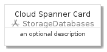
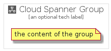

# CloudSpanner


```text
gcp/Item/StorageDatabases/CloudSpanner
```

```text
include('gcp/Item/StorageDatabases/CloudSpanner')
```


| Illustration | CloudSpanner | CloudSpannerCard | CloudSpannerGroup |
| :---: | :---: | :---: | :---: |
|  |  |  |  |


## CloudSpanner

### Load remotely
```plantuml
@startuml
' configures the library
!global $LIB_BASE_LOCATION="https://github.com/tmorin/plantuml-libs/distribution"

' loads the library's bootstrap
!include $LIB_BASE_LOCATION/bootstrap.puml

' loads the package bootstrap
include('gcp/bootstrap')

' loads the Item which embeds the element CloudSpanner
include('gcp/Item/StorageDatabases/CloudSpanner')

' renders the element
CloudSpanner('CloudSpanner', 'Cloud Spanner', 'an optional tech label')
@enduml
```

### Load locally
```plantuml
@startuml
' configures the library
!global $INCLUSION_MODE="local"
!global $LIB_BASE_LOCATION="../../.."

' loads the library's bootstrap
!include $LIB_BASE_LOCATION/bootstrap.puml

' loads the package bootstrap
include('gcp/bootstrap')

' loads the Item which embeds the element CloudSpanner
include('gcp/Item/StorageDatabases/CloudSpanner')

' renders the element
CloudSpanner('CloudSpanner', 'Cloud Spanner', 'an optional tech label')
@enduml
```

## CloudSpannerCard

### Load remotely
```plantuml
@startuml
' configures the library
!global $LIB_BASE_LOCATION="https://github.com/tmorin/plantuml-libs/distribution"

' loads the library's bootstrap
!include $LIB_BASE_LOCATION/bootstrap.puml

' loads the package bootstrap
include('gcp/bootstrap')

' loads the Item which embeds the element CloudSpannerCard
include('gcp/Item/StorageDatabases/CloudSpanner')

' renders the element
CloudSpannerCard('CloudSpannerCard', 'Cloud Spanner Card', 'an optional description')
@enduml
```

### Load locally
```plantuml
@startuml
' configures the library
!global $INCLUSION_MODE="local"
!global $LIB_BASE_LOCATION="../../.."

' loads the library's bootstrap
!include $LIB_BASE_LOCATION/bootstrap.puml

' loads the package bootstrap
include('gcp/bootstrap')

' loads the Item which embeds the element CloudSpannerCard
include('gcp/Item/StorageDatabases/CloudSpanner')

' renders the element
CloudSpannerCard('CloudSpannerCard', 'Cloud Spanner Card', 'an optional description')
@enduml
```

## CloudSpannerGroup

### Load remotely
```plantuml
@startuml
' configures the library
!global $LIB_BASE_LOCATION="https://github.com/tmorin/plantuml-libs/distribution"

' loads the library's bootstrap
!include $LIB_BASE_LOCATION/bootstrap.puml

' loads the package bootstrap
include('gcp/bootstrap')

' loads the Item which embeds the element CloudSpannerGroup
include('gcp/Item/StorageDatabases/CloudSpanner')

' renders the element
CloudSpannerGroup('CloudSpannerGroup', 'Cloud Spanner Group', 'an optional tech label') {
    note as note
        the content of the group
    end note
}
@enduml
```

### Load locally
```plantuml
@startuml
' configures the library
!global $INCLUSION_MODE="local"
!global $LIB_BASE_LOCATION="../../.."

' loads the library's bootstrap
!include $LIB_BASE_LOCATION/bootstrap.puml

' loads the package bootstrap
include('gcp/bootstrap')

' loads the Item which embeds the element CloudSpannerGroup
include('gcp/Item/StorageDatabases/CloudSpanner')

' renders the element
CloudSpannerGroup('CloudSpannerGroup', 'Cloud Spanner Group', 'an optional tech label') {
    note as note
        the content of the group
    end note
}
@enduml
```

