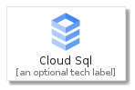
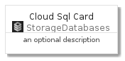
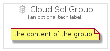

# CloudSql


```text
gcp/Item/StorageDatabases/CloudSql
```

```text
include('gcp/Item/StorageDatabases/CloudSql')
```


| Illustration | CloudSql | CloudSqlCard | CloudSqlGroup |
| :---: | :---: | :---: | :---: |
|  |  |  |  |


## CloudSql

### Load remotely
```plantuml
@startuml
' configures the library
!global $LIB_BASE_LOCATION="https://raw.githubusercontent.com/tmorin/plantuml-libs/master/distribution"

' loads the library's bootstrap
!include $LIB_BASE_LOCATION/bootstrap.puml

' loads the package bootstrap
include('gcp/bootstrap')

' loads the Item which embeds the element CloudSql
include('gcp/Item/StorageDatabases/CloudSql')

' renders the element
CloudSql('CloudSql', 'Cloud Sql', 'an optional tech label')
@enduml
```

### Load locally
```plantuml
@startuml
' configures the library
!global $INCLUSION_MODE="local"
!global $LIB_BASE_LOCATION="../../.."

' loads the library's bootstrap
!include $LIB_BASE_LOCATION/bootstrap.puml

' loads the package bootstrap
include('gcp/bootstrap')

' loads the Item which embeds the element CloudSql
include('gcp/Item/StorageDatabases/CloudSql')

' renders the element
CloudSql('CloudSql', 'Cloud Sql', 'an optional tech label')
@enduml
```

## CloudSqlCard

### Load remotely
```plantuml
@startuml
' configures the library
!global $LIB_BASE_LOCATION="https://raw.githubusercontent.com/tmorin/plantuml-libs/master/distribution"

' loads the library's bootstrap
!include $LIB_BASE_LOCATION/bootstrap.puml

' loads the package bootstrap
include('gcp/bootstrap')

' loads the Item which embeds the element CloudSqlCard
include('gcp/Item/StorageDatabases/CloudSql')

' renders the element
CloudSqlCard('CloudSqlCard', 'Cloud Sql Card', 'an optional description')
@enduml
```

### Load locally
```plantuml
@startuml
' configures the library
!global $INCLUSION_MODE="local"
!global $LIB_BASE_LOCATION="../../.."

' loads the library's bootstrap
!include $LIB_BASE_LOCATION/bootstrap.puml

' loads the package bootstrap
include('gcp/bootstrap')

' loads the Item which embeds the element CloudSqlCard
include('gcp/Item/StorageDatabases/CloudSql')

' renders the element
CloudSqlCard('CloudSqlCard', 'Cloud Sql Card', 'an optional description')
@enduml
```

## CloudSqlGroup

### Load remotely
```plantuml
@startuml
' configures the library
!global $LIB_BASE_LOCATION="https://raw.githubusercontent.com/tmorin/plantuml-libs/master/distribution"

' loads the library's bootstrap
!include $LIB_BASE_LOCATION/bootstrap.puml

' loads the package bootstrap
include('gcp/bootstrap')

' loads the Item which embeds the element CloudSqlGroup
include('gcp/Item/StorageDatabases/CloudSql')

' renders the element
CloudSqlGroup('CloudSqlGroup', 'Cloud Sql Group', 'an optional tech label') {
    note as note
        the content of the group
    end note
}
@enduml
```

### Load locally
```plantuml
@startuml
' configures the library
!global $INCLUSION_MODE="local"
!global $LIB_BASE_LOCATION="../../.."

' loads the library's bootstrap
!include $LIB_BASE_LOCATION/bootstrap.puml

' loads the package bootstrap
include('gcp/bootstrap')

' loads the Item which embeds the element CloudSqlGroup
include('gcp/Item/StorageDatabases/CloudSql')

' renders the element
CloudSqlGroup('CloudSqlGroup', 'Cloud Sql Group', 'an optional tech label') {
    note as note
        the content of the group
    end note
}
@enduml
```

