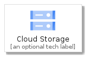
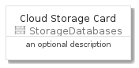
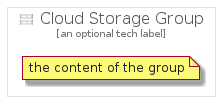

# CloudStorage


```text
gcp/Item/StorageDatabases/CloudStorage
```

```text
include('gcp/Item/StorageDatabases/CloudStorage')
```


| Illustration | CloudStorage | CloudStorageCard | CloudStorageGroup |
| :---: | :---: | :---: | :---: |
|  |  |  |  |


## CloudStorage

### Load remotely
```plantuml
@startuml
' configures the library
!global $LIB_BASE_LOCATION="https://github.com/tmorin/plantuml-libs/distribution"

' loads the library's bootstrap
!include $LIB_BASE_LOCATION/bootstrap.puml

' loads the package bootstrap
include('gcp/bootstrap')

' loads the Item which embeds the element CloudStorage
include('gcp/Item/StorageDatabases/CloudStorage')

' renders the element
CloudStorage('CloudStorage', 'Cloud Storage', 'an optional tech label')
@enduml
```

### Load locally
```plantuml
@startuml
' configures the library
!global $INCLUSION_MODE="local"
!global $LIB_BASE_LOCATION="../../.."

' loads the library's bootstrap
!include $LIB_BASE_LOCATION/bootstrap.puml

' loads the package bootstrap
include('gcp/bootstrap')

' loads the Item which embeds the element CloudStorage
include('gcp/Item/StorageDatabases/CloudStorage')

' renders the element
CloudStorage('CloudStorage', 'Cloud Storage', 'an optional tech label')
@enduml
```

## CloudStorageCard

### Load remotely
```plantuml
@startuml
' configures the library
!global $LIB_BASE_LOCATION="https://github.com/tmorin/plantuml-libs/distribution"

' loads the library's bootstrap
!include $LIB_BASE_LOCATION/bootstrap.puml

' loads the package bootstrap
include('gcp/bootstrap')

' loads the Item which embeds the element CloudStorageCard
include('gcp/Item/StorageDatabases/CloudStorage')

' renders the element
CloudStorageCard('CloudStorageCard', 'Cloud Storage Card', 'an optional description')
@enduml
```

### Load locally
```plantuml
@startuml
' configures the library
!global $INCLUSION_MODE="local"
!global $LIB_BASE_LOCATION="../../.."

' loads the library's bootstrap
!include $LIB_BASE_LOCATION/bootstrap.puml

' loads the package bootstrap
include('gcp/bootstrap')

' loads the Item which embeds the element CloudStorageCard
include('gcp/Item/StorageDatabases/CloudStorage')

' renders the element
CloudStorageCard('CloudStorageCard', 'Cloud Storage Card', 'an optional description')
@enduml
```

## CloudStorageGroup

### Load remotely
```plantuml
@startuml
' configures the library
!global $LIB_BASE_LOCATION="https://github.com/tmorin/plantuml-libs/distribution"

' loads the library's bootstrap
!include $LIB_BASE_LOCATION/bootstrap.puml

' loads the package bootstrap
include('gcp/bootstrap')

' loads the Item which embeds the element CloudStorageGroup
include('gcp/Item/StorageDatabases/CloudStorage')

' renders the element
CloudStorageGroup('CloudStorageGroup', 'Cloud Storage Group', 'an optional tech label') {
    note as note
        the content of the group
    end note
}
@enduml
```

### Load locally
```plantuml
@startuml
' configures the library
!global $INCLUSION_MODE="local"
!global $LIB_BASE_LOCATION="../../.."

' loads the library's bootstrap
!include $LIB_BASE_LOCATION/bootstrap.puml

' loads the package bootstrap
include('gcp/bootstrap')

' loads the Item which embeds the element CloudStorageGroup
include('gcp/Item/StorageDatabases/CloudStorage')

' renders the element
CloudStorageGroup('CloudStorageGroup', 'Cloud Storage Group', 'an optional tech label') {
    note as note
        the content of the group
    end note
}
@enduml
```

