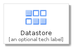
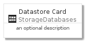
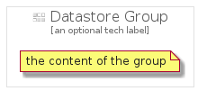

# Datastore


```text
gcp/Item/StorageDatabases/Datastore
```

```text
include('gcp/Item/StorageDatabases/Datastore')
```


| Illustration | Datastore | DatastoreCard | DatastoreGroup |
| :---: | :---: | :---: | :---: |
|  |  |  |  |


## Datastore

### Load remotely
```plantuml
@startuml
' configures the library
!global $LIB_BASE_LOCATION="https://raw.githubusercontent.com/tmorin/plantuml-libs/master/distribution"

' loads the library's bootstrap
!include $LIB_BASE_LOCATION/bootstrap.puml

' loads the package bootstrap
include('gcp/bootstrap')

' loads the Item which embeds the element Datastore
include('gcp/Item/StorageDatabases/Datastore')

' renders the element
Datastore('Datastore', 'Datastore', 'an optional tech label')
@enduml
```

### Load locally
```plantuml
@startuml
' configures the library
!global $INCLUSION_MODE="local"
!global $LIB_BASE_LOCATION="../../.."

' loads the library's bootstrap
!include $LIB_BASE_LOCATION/bootstrap.puml

' loads the package bootstrap
include('gcp/bootstrap')

' loads the Item which embeds the element Datastore
include('gcp/Item/StorageDatabases/Datastore')

' renders the element
Datastore('Datastore', 'Datastore', 'an optional tech label')
@enduml
```

## DatastoreCard

### Load remotely
```plantuml
@startuml
' configures the library
!global $LIB_BASE_LOCATION="https://raw.githubusercontent.com/tmorin/plantuml-libs/master/distribution"

' loads the library's bootstrap
!include $LIB_BASE_LOCATION/bootstrap.puml

' loads the package bootstrap
include('gcp/bootstrap')

' loads the Item which embeds the element DatastoreCard
include('gcp/Item/StorageDatabases/Datastore')

' renders the element
DatastoreCard('DatastoreCard', 'Datastore Card', 'an optional description')
@enduml
```

### Load locally
```plantuml
@startuml
' configures the library
!global $INCLUSION_MODE="local"
!global $LIB_BASE_LOCATION="../../.."

' loads the library's bootstrap
!include $LIB_BASE_LOCATION/bootstrap.puml

' loads the package bootstrap
include('gcp/bootstrap')

' loads the Item which embeds the element DatastoreCard
include('gcp/Item/StorageDatabases/Datastore')

' renders the element
DatastoreCard('DatastoreCard', 'Datastore Card', 'an optional description')
@enduml
```

## DatastoreGroup

### Load remotely
```plantuml
@startuml
' configures the library
!global $LIB_BASE_LOCATION="https://raw.githubusercontent.com/tmorin/plantuml-libs/master/distribution"

' loads the library's bootstrap
!include $LIB_BASE_LOCATION/bootstrap.puml

' loads the package bootstrap
include('gcp/bootstrap')

' loads the Item which embeds the element DatastoreGroup
include('gcp/Item/StorageDatabases/Datastore')

' renders the element
DatastoreGroup('DatastoreGroup', 'Datastore Group', 'an optional tech label') {
    note as note
        the content of the group
    end note
}
@enduml
```

### Load locally
```plantuml
@startuml
' configures the library
!global $INCLUSION_MODE="local"
!global $LIB_BASE_LOCATION="../../.."

' loads the library's bootstrap
!include $LIB_BASE_LOCATION/bootstrap.puml

' loads the package bootstrap
include('gcp/bootstrap')

' loads the Item which embeds the element DatastoreGroup
include('gcp/Item/StorageDatabases/Datastore')

' renders the element
DatastoreGroup('DatastoreGroup', 'Datastore Group', 'an optional tech label') {
    note as note
        the content of the group
    end note
}
@enduml
```

