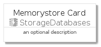
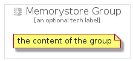

# Memorystore


```text
gcp/Item/StorageDatabases/Memorystore
```

```text
include('gcp/Item/StorageDatabases/Memorystore')
```


| Illustration | Memorystore | MemorystoreCard | MemorystoreGroup |
| :---: | :---: | :---: | :---: |
|  |  |  |  |


## Memorystore

### Load remotely
```plantuml
@startuml
' configures the library
!global $LIB_BASE_LOCATION="https://github.com/tmorin/plantuml-libs/distribution"

' loads the library's bootstrap
!include $LIB_BASE_LOCATION/bootstrap.puml

' loads the package bootstrap
include('gcp/bootstrap')

' loads the Item which embeds the element Memorystore
include('gcp/Item/StorageDatabases/Memorystore')

' renders the element
Memorystore('Memorystore', 'Memorystore', 'an optional tech label')
@enduml
```

### Load locally
```plantuml
@startuml
' configures the library
!global $INCLUSION_MODE="local"
!global $LIB_BASE_LOCATION="../../.."

' loads the library's bootstrap
!include $LIB_BASE_LOCATION/bootstrap.puml

' loads the package bootstrap
include('gcp/bootstrap')

' loads the Item which embeds the element Memorystore
include('gcp/Item/StorageDatabases/Memorystore')

' renders the element
Memorystore('Memorystore', 'Memorystore', 'an optional tech label')
@enduml
```

## MemorystoreCard

### Load remotely
```plantuml
@startuml
' configures the library
!global $LIB_BASE_LOCATION="https://github.com/tmorin/plantuml-libs/distribution"

' loads the library's bootstrap
!include $LIB_BASE_LOCATION/bootstrap.puml

' loads the package bootstrap
include('gcp/bootstrap')

' loads the Item which embeds the element MemorystoreCard
include('gcp/Item/StorageDatabases/Memorystore')

' renders the element
MemorystoreCard('MemorystoreCard', 'Memorystore Card', 'an optional description')
@enduml
```

### Load locally
```plantuml
@startuml
' configures the library
!global $INCLUSION_MODE="local"
!global $LIB_BASE_LOCATION="../../.."

' loads the library's bootstrap
!include $LIB_BASE_LOCATION/bootstrap.puml

' loads the package bootstrap
include('gcp/bootstrap')

' loads the Item which embeds the element MemorystoreCard
include('gcp/Item/StorageDatabases/Memorystore')

' renders the element
MemorystoreCard('MemorystoreCard', 'Memorystore Card', 'an optional description')
@enduml
```

## MemorystoreGroup

### Load remotely
```plantuml
@startuml
' configures the library
!global $LIB_BASE_LOCATION="https://github.com/tmorin/plantuml-libs/distribution"

' loads the library's bootstrap
!include $LIB_BASE_LOCATION/bootstrap.puml

' loads the package bootstrap
include('gcp/bootstrap')

' loads the Item which embeds the element MemorystoreGroup
include('gcp/Item/StorageDatabases/Memorystore')

' renders the element
MemorystoreGroup('MemorystoreGroup', 'Memorystore Group', 'an optional tech label') {
    note as note
        the content of the group
    end note
}
@enduml
```

### Load locally
```plantuml
@startuml
' configures the library
!global $INCLUSION_MODE="local"
!global $LIB_BASE_LOCATION="../../.."

' loads the library's bootstrap
!include $LIB_BASE_LOCATION/bootstrap.puml

' loads the package bootstrap
include('gcp/bootstrap')

' loads the Item which embeds the element MemorystoreGroup
include('gcp/Item/StorageDatabases/Memorystore')

' renders the element
MemorystoreGroup('MemorystoreGroup', 'Memorystore Group', 'an optional tech label') {
    note as note
        the content of the group
    end note
}
@enduml
```

