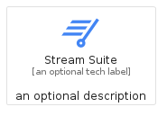
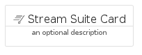
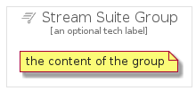

# StreamSuite


```text
gcp/Item/StreamSuite
```

```text
include('gcp/Item/StreamSuite')
```


| Illustration | StreamSuite | StreamSuiteCard | StreamSuiteGroup |
| :---: | :---: | :---: | :---: |
|  |  |  |  |


## StreamSuite

### Load remotely
```plantuml
@startuml
' configures the library
!global $LIB_BASE_LOCATION="https://raw.githubusercontent.com/tmorin/plantuml-libs/master/distribution"

' loads the library's bootstrap
!include $LIB_BASE_LOCATION/bootstrap.puml

' loads the package bootstrap
include('gcp/bootstrap')

' loads the Item which embeds the element StreamSuite
include('gcp/Item/StreamSuite')

' renders the element
StreamSuite('StreamSuite', 'Stream Suite', 'an optional tech label', 'an optional description')
@enduml
```

### Load locally
```plantuml
@startuml
' configures the library
!global $INCLUSION_MODE="local"
!global $LIB_BASE_LOCATION="../.."

' loads the library's bootstrap
!include $LIB_BASE_LOCATION/bootstrap.puml

' loads the package bootstrap
include('gcp/bootstrap')

' loads the Item which embeds the element StreamSuite
include('gcp/Item/StreamSuite')

' renders the element
StreamSuite('StreamSuite', 'Stream Suite', 'an optional tech label', 'an optional description')
@enduml
```

## StreamSuiteCard

### Load remotely
```plantuml
@startuml
' configures the library
!global $LIB_BASE_LOCATION="https://raw.githubusercontent.com/tmorin/plantuml-libs/master/distribution"

' loads the library's bootstrap
!include $LIB_BASE_LOCATION/bootstrap.puml

' loads the package bootstrap
include('gcp/bootstrap')

' loads the Item which embeds the element StreamSuiteCard
include('gcp/Item/StreamSuite')

' renders the element
StreamSuiteCard('StreamSuiteCard', 'Stream Suite Card', 'an optional description')
@enduml
```

### Load locally
```plantuml
@startuml
' configures the library
!global $INCLUSION_MODE="local"
!global $LIB_BASE_LOCATION="../.."

' loads the library's bootstrap
!include $LIB_BASE_LOCATION/bootstrap.puml

' loads the package bootstrap
include('gcp/bootstrap')

' loads the Item which embeds the element StreamSuiteCard
include('gcp/Item/StreamSuite')

' renders the element
StreamSuiteCard('StreamSuiteCard', 'Stream Suite Card', 'an optional description')
@enduml
```

## StreamSuiteGroup

### Load remotely
```plantuml
@startuml
' configures the library
!global $LIB_BASE_LOCATION="https://raw.githubusercontent.com/tmorin/plantuml-libs/master/distribution"

' loads the library's bootstrap
!include $LIB_BASE_LOCATION/bootstrap.puml

' loads the package bootstrap
include('gcp/bootstrap')

' loads the Item which embeds the element StreamSuiteGroup
include('gcp/Item/StreamSuite')

' renders the element
StreamSuiteGroup('StreamSuiteGroup', 'Stream Suite Group', 'an optional tech label') {
    note as note
        the content of the group
    end note
}
@enduml
```

### Load locally
```plantuml
@startuml
' configures the library
!global $INCLUSION_MODE="local"
!global $LIB_BASE_LOCATION="../.."

' loads the library's bootstrap
!include $LIB_BASE_LOCATION/bootstrap.puml

' loads the package bootstrap
include('gcp/bootstrap')

' loads the Item which embeds the element StreamSuiteGroup
include('gcp/Item/StreamSuite')

' renders the element
StreamSuiteGroup('StreamSuiteGroup', 'Stream Suite Group', 'an optional tech label') {
    note as note
        the content of the group
    end note
}
@enduml
```

