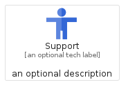
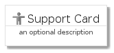
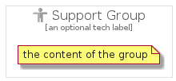

# Support


```text
gcp/Item/Support
```

```text
include('gcp/Item/Support')
```


| Illustration | Support | SupportCard | SupportGroup |
| :---: | :---: | :---: | :---: |
|  |  |  |  |


## Support

### Load remotely
```plantuml
@startuml
' configures the library
!global $LIB_BASE_LOCATION="https://raw.githubusercontent.com/tmorin/plantuml-libs/master/distribution"

' loads the library's bootstrap
!include $LIB_BASE_LOCATION/bootstrap.puml

' loads the package bootstrap
include('gcp/bootstrap')

' loads the Item which embeds the element Support
include('gcp/Item/Support')

' renders the element
Support('Support', 'Support', 'an optional tech label', 'an optional description')
@enduml
```

### Load locally
```plantuml
@startuml
' configures the library
!global $INCLUSION_MODE="local"
!global $LIB_BASE_LOCATION="../.."

' loads the library's bootstrap
!include $LIB_BASE_LOCATION/bootstrap.puml

' loads the package bootstrap
include('gcp/bootstrap')

' loads the Item which embeds the element Support
include('gcp/Item/Support')

' renders the element
Support('Support', 'Support', 'an optional tech label', 'an optional description')
@enduml
```

## SupportCard

### Load remotely
```plantuml
@startuml
' configures the library
!global $LIB_BASE_LOCATION="https://raw.githubusercontent.com/tmorin/plantuml-libs/master/distribution"

' loads the library's bootstrap
!include $LIB_BASE_LOCATION/bootstrap.puml

' loads the package bootstrap
include('gcp/bootstrap')

' loads the Item which embeds the element SupportCard
include('gcp/Item/Support')

' renders the element
SupportCard('SupportCard', 'Support Card', 'an optional description')
@enduml
```

### Load locally
```plantuml
@startuml
' configures the library
!global $INCLUSION_MODE="local"
!global $LIB_BASE_LOCATION="../.."

' loads the library's bootstrap
!include $LIB_BASE_LOCATION/bootstrap.puml

' loads the package bootstrap
include('gcp/bootstrap')

' loads the Item which embeds the element SupportCard
include('gcp/Item/Support')

' renders the element
SupportCard('SupportCard', 'Support Card', 'an optional description')
@enduml
```

## SupportGroup

### Load remotely
```plantuml
@startuml
' configures the library
!global $LIB_BASE_LOCATION="https://raw.githubusercontent.com/tmorin/plantuml-libs/master/distribution"

' loads the library's bootstrap
!include $LIB_BASE_LOCATION/bootstrap.puml

' loads the package bootstrap
include('gcp/bootstrap')

' loads the Item which embeds the element SupportGroup
include('gcp/Item/Support')

' renders the element
SupportGroup('SupportGroup', 'Support Group', 'an optional tech label') {
    note as note
        the content of the group
    end note
}
@enduml
```

### Load locally
```plantuml
@startuml
' configures the library
!global $INCLUSION_MODE="local"
!global $LIB_BASE_LOCATION="../.."

' loads the library's bootstrap
!include $LIB_BASE_LOCATION/bootstrap.puml

' loads the package bootstrap
include('gcp/bootstrap')

' loads the Item which embeds the element SupportGroup
include('gcp/Item/Support')

' renders the element
SupportGroup('SupportGroup', 'Support Group', 'an optional tech label') {
    note as note
        the content of the group
    end note
}
@enduml
```

