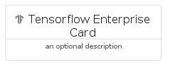
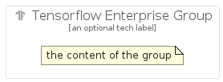

# TensorflowEnterprise


```text
gcp/Item/TensorflowEnterprise
```

```text
include('gcp/Item/TensorflowEnterprise')
```


| Illustration | TensorflowEnterprise | TensorflowEnterpriseCard | TensorflowEnterpriseGroup |
| :---: | :---: | :---: | :---: |
|  |  |  |  |


## Sprites
The item provides the following sriptes:

- `<$TensorflowEnterpriseXs>`
- `<$TensorflowEnterpriseSm>`
- `<$TensorflowEnterpriseMd>`
- `<$TensorflowEnterpriseLg>`


## TensorflowEnterprise

### Load remotely
```plantuml
@startuml
' configures the library
!global $LIB_BASE_LOCATION="https://raw.githubusercontent.com/tmorin/plantuml-libs/master/distribution"

' loads the library's bootstrap
!include $LIB_BASE_LOCATION/bootstrap.puml

' loads the package bootstrap
include('gcp/bootstrap')

' loads the Item which embeds the element TensorflowEnterprise
include('gcp/Item/TensorflowEnterprise')

' renders the element
TensorflowEnterprise('TensorflowEnterprise', 'Tensorflow Enterprise', 'an optional tech label', 'an optional description')
@enduml
```

### Load locally
```plantuml
@startuml
' configures the library
!global $INCLUSION_MODE="local"
!global $LIB_BASE_LOCATION="../.."

' loads the library's bootstrap
!include $LIB_BASE_LOCATION/bootstrap.puml

' loads the package bootstrap
include('gcp/bootstrap')

' loads the Item which embeds the element TensorflowEnterprise
include('gcp/Item/TensorflowEnterprise')

' renders the element
TensorflowEnterprise('TensorflowEnterprise', 'Tensorflow Enterprise', 'an optional tech label', 'an optional description')
@enduml
```

## TensorflowEnterpriseCard

### Load remotely
```plantuml
@startuml
' configures the library
!global $LIB_BASE_LOCATION="https://raw.githubusercontent.com/tmorin/plantuml-libs/master/distribution"

' loads the library's bootstrap
!include $LIB_BASE_LOCATION/bootstrap.puml

' loads the package bootstrap
include('gcp/bootstrap')

' loads the Item which embeds the element TensorflowEnterpriseCard
include('gcp/Item/TensorflowEnterprise')

' renders the element
TensorflowEnterpriseCard('TensorflowEnterpriseCard', 'Tensorflow Enterprise Card', 'an optional description')
@enduml
```

### Load locally
```plantuml
@startuml
' configures the library
!global $INCLUSION_MODE="local"
!global $LIB_BASE_LOCATION="../.."

' loads the library's bootstrap
!include $LIB_BASE_LOCATION/bootstrap.puml

' loads the package bootstrap
include('gcp/bootstrap')

' loads the Item which embeds the element TensorflowEnterpriseCard
include('gcp/Item/TensorflowEnterprise')

' renders the element
TensorflowEnterpriseCard('TensorflowEnterpriseCard', 'Tensorflow Enterprise Card', 'an optional description')
@enduml
```

## TensorflowEnterpriseGroup

### Load remotely
```plantuml
@startuml
' configures the library
!global $LIB_BASE_LOCATION="https://raw.githubusercontent.com/tmorin/plantuml-libs/master/distribution"

' loads the library's bootstrap
!include $LIB_BASE_LOCATION/bootstrap.puml

' loads the package bootstrap
include('gcp/bootstrap')

' loads the Item which embeds the element TensorflowEnterpriseGroup
include('gcp/Item/TensorflowEnterprise')

' renders the element
TensorflowEnterpriseGroup('TensorflowEnterpriseGroup', 'Tensorflow Enterprise Group', 'an optional tech label') {
    note as note
        the content of the group
    end note
}
@enduml
```

### Load locally
```plantuml
@startuml
' configures the library
!global $INCLUSION_MODE="local"
!global $LIB_BASE_LOCATION="../.."

' loads the library's bootstrap
!include $LIB_BASE_LOCATION/bootstrap.puml

' loads the package bootstrap
include('gcp/bootstrap')

' loads the Item which embeds the element TensorflowEnterpriseGroup
include('gcp/Item/TensorflowEnterprise')

' renders the element
TensorflowEnterpriseGroup('TensorflowEnterpriseGroup', 'Tensorflow Enterprise Group', 'an optional tech label') {
    note as note
        the content of the group
    end note
}
@enduml
```

