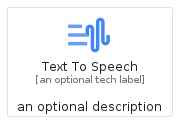
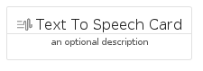

# TextToSpeech


```text
gcp/Item/TextToSpeech
```

```text
include('gcp/Item/TextToSpeech')
```


| Illustration | TextToSpeech | TextToSpeechCard | TextToSpeechGroup |
| :---: | :---: | :---: | :---: |
|  |  |  |  |


## TextToSpeech

### Load remotely
```plantuml
@startuml
' configures the library
!global $LIB_BASE_LOCATION="https://raw.githubusercontent.com/tmorin/plantuml-libs/master/distribution"

' loads the library's bootstrap
!include $LIB_BASE_LOCATION/bootstrap.puml

' loads the package bootstrap
include('gcp/bootstrap')

' loads the Item which embeds the element TextToSpeech
include('gcp/Item/TextToSpeech')

' renders the element
TextToSpeech('TextToSpeech', 'Text To Speech', 'an optional tech label', 'an optional description')
@enduml
```

### Load locally
```plantuml
@startuml
' configures the library
!global $INCLUSION_MODE="local"
!global $LIB_BASE_LOCATION="../.."

' loads the library's bootstrap
!include $LIB_BASE_LOCATION/bootstrap.puml

' loads the package bootstrap
include('gcp/bootstrap')

' loads the Item which embeds the element TextToSpeech
include('gcp/Item/TextToSpeech')

' renders the element
TextToSpeech('TextToSpeech', 'Text To Speech', 'an optional tech label', 'an optional description')
@enduml
```

## TextToSpeechCard

### Load remotely
```plantuml
@startuml
' configures the library
!global $LIB_BASE_LOCATION="https://raw.githubusercontent.com/tmorin/plantuml-libs/master/distribution"

' loads the library's bootstrap
!include $LIB_BASE_LOCATION/bootstrap.puml

' loads the package bootstrap
include('gcp/bootstrap')

' loads the Item which embeds the element TextToSpeechCard
include('gcp/Item/TextToSpeech')

' renders the element
TextToSpeechCard('TextToSpeechCard', 'Text To Speech Card', 'an optional description')
@enduml
```

### Load locally
```plantuml
@startuml
' configures the library
!global $INCLUSION_MODE="local"
!global $LIB_BASE_LOCATION="../.."

' loads the library's bootstrap
!include $LIB_BASE_LOCATION/bootstrap.puml

' loads the package bootstrap
include('gcp/bootstrap')

' loads the Item which embeds the element TextToSpeechCard
include('gcp/Item/TextToSpeech')

' renders the element
TextToSpeechCard('TextToSpeechCard', 'Text To Speech Card', 'an optional description')
@enduml
```

## TextToSpeechGroup

### Load remotely
```plantuml
@startuml
' configures the library
!global $LIB_BASE_LOCATION="https://raw.githubusercontent.com/tmorin/plantuml-libs/master/distribution"

' loads the library's bootstrap
!include $LIB_BASE_LOCATION/bootstrap.puml

' loads the package bootstrap
include('gcp/bootstrap')

' loads the Item which embeds the element TextToSpeechGroup
include('gcp/Item/TextToSpeech')

' renders the element
TextToSpeechGroup('TextToSpeechGroup', 'Text To Speech Group', 'an optional tech label') {
    note as note
        the content of the group
    end note
}
@enduml
```

### Load locally
```plantuml
@startuml
' configures the library
!global $INCLUSION_MODE="local"
!global $LIB_BASE_LOCATION="../.."

' loads the library's bootstrap
!include $LIB_BASE_LOCATION/bootstrap.puml

' loads the package bootstrap
include('gcp/bootstrap')

' loads the Item which embeds the element TextToSpeechGroup
include('gcp/Item/TextToSpeech')

' renders the element
TextToSpeechGroup('TextToSpeechGroup', 'Text To Speech Group', 'an optional tech label') {
    note as note
        the content of the group
    end note
}
@enduml
```

