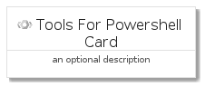
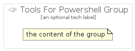

# ToolsForPowershell


```text
gcp/Item/ToolsForPowershell
```

```text
include('gcp/Item/ToolsForPowershell')
```


| Illustration | ToolsForPowershell | ToolsForPowershellCard | ToolsForPowershellGroup |
| :---: | :---: | :---: | :---: |
|  |  |  |  |


## ToolsForPowershell

### Load remotely
```plantuml
@startuml
' configures the library
!global $LIB_BASE_LOCATION="https://raw.githubusercontent.com/tmorin/plantuml-libs/master/distribution"

' loads the library's bootstrap
!include $LIB_BASE_LOCATION/bootstrap.puml

' loads the package bootstrap
include('gcp/bootstrap')

' loads the Item which embeds the element ToolsForPowershell
include('gcp/Item/ToolsForPowershell')

' renders the element
ToolsForPowershell('ToolsForPowershell', 'Tools For Powershell', 'an optional tech label', 'an optional description')
@enduml
```

### Load locally
```plantuml
@startuml
' configures the library
!global $INCLUSION_MODE="local"
!global $LIB_BASE_LOCATION="../.."

' loads the library's bootstrap
!include $LIB_BASE_LOCATION/bootstrap.puml

' loads the package bootstrap
include('gcp/bootstrap')

' loads the Item which embeds the element ToolsForPowershell
include('gcp/Item/ToolsForPowershell')

' renders the element
ToolsForPowershell('ToolsForPowershell', 'Tools For Powershell', 'an optional tech label', 'an optional description')
@enduml
```

## ToolsForPowershellCard

### Load remotely
```plantuml
@startuml
' configures the library
!global $LIB_BASE_LOCATION="https://raw.githubusercontent.com/tmorin/plantuml-libs/master/distribution"

' loads the library's bootstrap
!include $LIB_BASE_LOCATION/bootstrap.puml

' loads the package bootstrap
include('gcp/bootstrap')

' loads the Item which embeds the element ToolsForPowershellCard
include('gcp/Item/ToolsForPowershell')

' renders the element
ToolsForPowershellCard('ToolsForPowershellCard', 'Tools For Powershell Card', 'an optional description')
@enduml
```

### Load locally
```plantuml
@startuml
' configures the library
!global $INCLUSION_MODE="local"
!global $LIB_BASE_LOCATION="../.."

' loads the library's bootstrap
!include $LIB_BASE_LOCATION/bootstrap.puml

' loads the package bootstrap
include('gcp/bootstrap')

' loads the Item which embeds the element ToolsForPowershellCard
include('gcp/Item/ToolsForPowershell')

' renders the element
ToolsForPowershellCard('ToolsForPowershellCard', 'Tools For Powershell Card', 'an optional description')
@enduml
```

## ToolsForPowershellGroup

### Load remotely
```plantuml
@startuml
' configures the library
!global $LIB_BASE_LOCATION="https://raw.githubusercontent.com/tmorin/plantuml-libs/master/distribution"

' loads the library's bootstrap
!include $LIB_BASE_LOCATION/bootstrap.puml

' loads the package bootstrap
include('gcp/bootstrap')

' loads the Item which embeds the element ToolsForPowershellGroup
include('gcp/Item/ToolsForPowershell')

' renders the element
ToolsForPowershellGroup('ToolsForPowershellGroup', 'Tools For Powershell Group', 'an optional tech label') {
    note as note
        the content of the group
    end note
}
@enduml
```

### Load locally
```plantuml
@startuml
' configures the library
!global $INCLUSION_MODE="local"
!global $LIB_BASE_LOCATION="../.."

' loads the library's bootstrap
!include $LIB_BASE_LOCATION/bootstrap.puml

' loads the package bootstrap
include('gcp/bootstrap')

' loads the Item which embeds the element ToolsForPowershellGroup
include('gcp/Item/ToolsForPowershell')

' renders the element
ToolsForPowershellGroup('ToolsForPowershellGroup', 'Tools For Powershell Group', 'an optional tech label') {
    note as note
        the content of the group
    end note
}
@enduml
```

