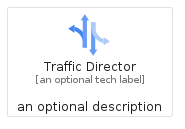
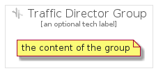

# TrafficDirector


```text
gcp/Item/TrafficDirector
```

```text
include('gcp/Item/TrafficDirector')
```


| Illustration | TrafficDirector | TrafficDirectorCard | TrafficDirectorGroup |
| :---: | :---: | :---: | :---: |
|  |  |  |  |


## Sprites
The item provides the following sriptes:

- `<$TrafficDirectorXs>`
- `<$TrafficDirectorSm>`
- `<$TrafficDirectorMd>`
- `<$TrafficDirectorLg>`


## TrafficDirector

### Load remotely
```plantuml
@startuml
' configures the library
!global $LIB_BASE_LOCATION="https://raw.githubusercontent.com/tmorin/plantuml-libs/master/distribution"

' loads the library's bootstrap
!include $LIB_BASE_LOCATION/bootstrap.puml

' loads the package bootstrap
include('gcp/bootstrap')

' loads the Item which embeds the element TrafficDirector
include('gcp/Item/TrafficDirector')

' renders the element
TrafficDirector('TrafficDirector', 'Traffic Director', 'an optional tech label', 'an optional description')
@enduml
```

### Load locally
```plantuml
@startuml
' configures the library
!global $INCLUSION_MODE="local"
!global $LIB_BASE_LOCATION="../.."

' loads the library's bootstrap
!include $LIB_BASE_LOCATION/bootstrap.puml

' loads the package bootstrap
include('gcp/bootstrap')

' loads the Item which embeds the element TrafficDirector
include('gcp/Item/TrafficDirector')

' renders the element
TrafficDirector('TrafficDirector', 'Traffic Director', 'an optional tech label', 'an optional description')
@enduml
```

## TrafficDirectorCard

### Load remotely
```plantuml
@startuml
' configures the library
!global $LIB_BASE_LOCATION="https://raw.githubusercontent.com/tmorin/plantuml-libs/master/distribution"

' loads the library's bootstrap
!include $LIB_BASE_LOCATION/bootstrap.puml

' loads the package bootstrap
include('gcp/bootstrap')

' loads the Item which embeds the element TrafficDirectorCard
include('gcp/Item/TrafficDirector')

' renders the element
TrafficDirectorCard('TrafficDirectorCard', 'Traffic Director Card', 'an optional description')
@enduml
```

### Load locally
```plantuml
@startuml
' configures the library
!global $INCLUSION_MODE="local"
!global $LIB_BASE_LOCATION="../.."

' loads the library's bootstrap
!include $LIB_BASE_LOCATION/bootstrap.puml

' loads the package bootstrap
include('gcp/bootstrap')

' loads the Item which embeds the element TrafficDirectorCard
include('gcp/Item/TrafficDirector')

' renders the element
TrafficDirectorCard('TrafficDirectorCard', 'Traffic Director Card', 'an optional description')
@enduml
```

## TrafficDirectorGroup

### Load remotely
```plantuml
@startuml
' configures the library
!global $LIB_BASE_LOCATION="https://raw.githubusercontent.com/tmorin/plantuml-libs/master/distribution"

' loads the library's bootstrap
!include $LIB_BASE_LOCATION/bootstrap.puml

' loads the package bootstrap
include('gcp/bootstrap')

' loads the Item which embeds the element TrafficDirectorGroup
include('gcp/Item/TrafficDirector')

' renders the element
TrafficDirectorGroup('TrafficDirectorGroup', 'Traffic Director Group', 'an optional tech label') {
    note as note
        the content of the group
    end note
}
@enduml
```

### Load locally
```plantuml
@startuml
' configures the library
!global $INCLUSION_MODE="local"
!global $LIB_BASE_LOCATION="../.."

' loads the library's bootstrap
!include $LIB_BASE_LOCATION/bootstrap.puml

' loads the package bootstrap
include('gcp/bootstrap')

' loads the Item which embeds the element TrafficDirectorGroup
include('gcp/Item/TrafficDirector')

' renders the element
TrafficDirectorGroup('TrafficDirectorGroup', 'Traffic Director Group', 'an optional tech label') {
    note as note
        the content of the group
    end note
}
@enduml
```

