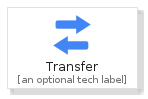
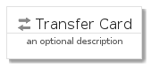
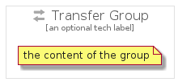

# Transfer


```text
gcp/Item/Transfer
```

```text
include('gcp/Item/Transfer')
```


| Illustration | Transfer | TransferCard | TransferGroup |
| :---: | :---: | :---: | :---: |
|  |  |  |  |


## Transfer

### Load remotely
```plantuml
@startuml
' configures the library
!global $LIB_BASE_LOCATION="https://raw.githubusercontent.com/tmorin/plantuml-libs/master/distribution"

' loads the library's bootstrap
!include $LIB_BASE_LOCATION/bootstrap.puml

' loads the package bootstrap
include('gcp/bootstrap')

' loads the Item which embeds the element Transfer
include('gcp/Item/Transfer')

' renders the element
Transfer('Transfer', 'Transfer', 'an optional tech label')
@enduml
```

### Load locally
```plantuml
@startuml
' configures the library
!global $INCLUSION_MODE="local"
!global $LIB_BASE_LOCATION="../.."

' loads the library's bootstrap
!include $LIB_BASE_LOCATION/bootstrap.puml

' loads the package bootstrap
include('gcp/bootstrap')

' loads the Item which embeds the element Transfer
include('gcp/Item/Transfer')

' renders the element
Transfer('Transfer', 'Transfer', 'an optional tech label')
@enduml
```

## TransferCard

### Load remotely
```plantuml
@startuml
' configures the library
!global $LIB_BASE_LOCATION="https://raw.githubusercontent.com/tmorin/plantuml-libs/master/distribution"

' loads the library's bootstrap
!include $LIB_BASE_LOCATION/bootstrap.puml

' loads the package bootstrap
include('gcp/bootstrap')

' loads the Item which embeds the element TransferCard
include('gcp/Item/Transfer')

' renders the element
TransferCard('TransferCard', 'Transfer Card', 'an optional description')
@enduml
```

### Load locally
```plantuml
@startuml
' configures the library
!global $INCLUSION_MODE="local"
!global $LIB_BASE_LOCATION="../.."

' loads the library's bootstrap
!include $LIB_BASE_LOCATION/bootstrap.puml

' loads the package bootstrap
include('gcp/bootstrap')

' loads the Item which embeds the element TransferCard
include('gcp/Item/Transfer')

' renders the element
TransferCard('TransferCard', 'Transfer Card', 'an optional description')
@enduml
```

## TransferGroup

### Load remotely
```plantuml
@startuml
' configures the library
!global $LIB_BASE_LOCATION="https://raw.githubusercontent.com/tmorin/plantuml-libs/master/distribution"

' loads the library's bootstrap
!include $LIB_BASE_LOCATION/bootstrap.puml

' loads the package bootstrap
include('gcp/bootstrap')

' loads the Item which embeds the element TransferGroup
include('gcp/Item/Transfer')

' renders the element
TransferGroup('TransferGroup', 'Transfer Group', 'an optional tech label') {
    note as note
        the content of the group
    end note
}
@enduml
```

### Load locally
```plantuml
@startuml
' configures the library
!global $INCLUSION_MODE="local"
!global $LIB_BASE_LOCATION="../.."

' loads the library's bootstrap
!include $LIB_BASE_LOCATION/bootstrap.puml

' loads the package bootstrap
include('gcp/bootstrap')

' loads the Item which embeds the element TransferGroup
include('gcp/Item/Transfer')

' renders the element
TransferGroup('TransferGroup', 'Transfer Group', 'an optional tech label') {
    note as note
        the content of the group
    end note
}
@enduml
```

