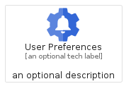
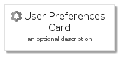
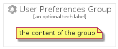

# UserPreferences


```text
gcp/Item/UserPreferences
```

```text
include('gcp/Item/UserPreferences')
```


| Illustration | UserPreferences | UserPreferencesCard | UserPreferencesGroup |
| :---: | :---: | :---: | :---: |
|  |  |  |  |


## UserPreferences

### Load remotely
```plantuml
@startuml
' configures the library
!global $LIB_BASE_LOCATION="https://raw.githubusercontent.com/tmorin/plantuml-libs/master/distribution"

' loads the library's bootstrap
!include $LIB_BASE_LOCATION/bootstrap.puml

' loads the package bootstrap
include('gcp/bootstrap')

' loads the Item which embeds the element UserPreferences
include('gcp/Item/UserPreferences')

' renders the element
UserPreferences('UserPreferences', 'User Preferences', 'an optional tech label', 'an optional description')
@enduml
```

### Load locally
```plantuml
@startuml
' configures the library
!global $INCLUSION_MODE="local"
!global $LIB_BASE_LOCATION="../.."

' loads the library's bootstrap
!include $LIB_BASE_LOCATION/bootstrap.puml

' loads the package bootstrap
include('gcp/bootstrap')

' loads the Item which embeds the element UserPreferences
include('gcp/Item/UserPreferences')

' renders the element
UserPreferences('UserPreferences', 'User Preferences', 'an optional tech label', 'an optional description')
@enduml
```

## UserPreferencesCard

### Load remotely
```plantuml
@startuml
' configures the library
!global $LIB_BASE_LOCATION="https://raw.githubusercontent.com/tmorin/plantuml-libs/master/distribution"

' loads the library's bootstrap
!include $LIB_BASE_LOCATION/bootstrap.puml

' loads the package bootstrap
include('gcp/bootstrap')

' loads the Item which embeds the element UserPreferencesCard
include('gcp/Item/UserPreferences')

' renders the element
UserPreferencesCard('UserPreferencesCard', 'User Preferences Card', 'an optional description')
@enduml
```

### Load locally
```plantuml
@startuml
' configures the library
!global $INCLUSION_MODE="local"
!global $LIB_BASE_LOCATION="../.."

' loads the library's bootstrap
!include $LIB_BASE_LOCATION/bootstrap.puml

' loads the package bootstrap
include('gcp/bootstrap')

' loads the Item which embeds the element UserPreferencesCard
include('gcp/Item/UserPreferences')

' renders the element
UserPreferencesCard('UserPreferencesCard', 'User Preferences Card', 'an optional description')
@enduml
```

## UserPreferencesGroup

### Load remotely
```plantuml
@startuml
' configures the library
!global $LIB_BASE_LOCATION="https://raw.githubusercontent.com/tmorin/plantuml-libs/master/distribution"

' loads the library's bootstrap
!include $LIB_BASE_LOCATION/bootstrap.puml

' loads the package bootstrap
include('gcp/bootstrap')

' loads the Item which embeds the element UserPreferencesGroup
include('gcp/Item/UserPreferences')

' renders the element
UserPreferencesGroup('UserPreferencesGroup', 'User Preferences Group', 'an optional tech label') {
    note as note
        the content of the group
    end note
}
@enduml
```

### Load locally
```plantuml
@startuml
' configures the library
!global $INCLUSION_MODE="local"
!global $LIB_BASE_LOCATION="../.."

' loads the library's bootstrap
!include $LIB_BASE_LOCATION/bootstrap.puml

' loads the package bootstrap
include('gcp/bootstrap')

' loads the Item which embeds the element UserPreferencesGroup
include('gcp/Item/UserPreferences')

' renders the element
UserPreferencesGroup('UserPreferencesGroup', 'User Preferences Group', 'an optional tech label') {
    note as note
        the content of the group
    end note
}
@enduml
```

