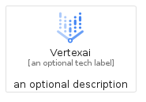
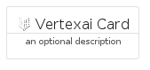
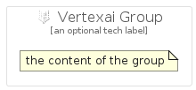

# Vertexai


```text
gcp/Item/Vertexai
```

```text
include('gcp/Item/Vertexai')
```


| Illustration | Vertexai | VertexaiCard | VertexaiGroup |
| :---: | :---: | :---: | :---: |
|  |  |  |  |


## Vertexai

### Load remotely
```plantuml
@startuml
' configures the library
!global $LIB_BASE_LOCATION="https://raw.githubusercontent.com/tmorin/plantuml-libs/master/distribution"

' loads the library's bootstrap
!include $LIB_BASE_LOCATION/bootstrap.puml

' loads the package bootstrap
include('gcp/bootstrap')

' loads the Item which embeds the element Vertexai
include('gcp/Item/Vertexai')

' renders the element
Vertexai('Vertexai', 'Vertexai', 'an optional tech label')
@enduml
```

### Load locally
```plantuml
@startuml
' configures the library
!global $INCLUSION_MODE="local"
!global $LIB_BASE_LOCATION="../.."

' loads the library's bootstrap
!include $LIB_BASE_LOCATION/bootstrap.puml

' loads the package bootstrap
include('gcp/bootstrap')

' loads the Item which embeds the element Vertexai
include('gcp/Item/Vertexai')

' renders the element
Vertexai('Vertexai', 'Vertexai', 'an optional tech label')
@enduml
```

## VertexaiCard

### Load remotely
```plantuml
@startuml
' configures the library
!global $LIB_BASE_LOCATION="https://raw.githubusercontent.com/tmorin/plantuml-libs/master/distribution"

' loads the library's bootstrap
!include $LIB_BASE_LOCATION/bootstrap.puml

' loads the package bootstrap
include('gcp/bootstrap')

' loads the Item which embeds the element VertexaiCard
include('gcp/Item/Vertexai')

' renders the element
VertexaiCard('VertexaiCard', 'Vertexai Card', 'an optional description')
@enduml
```

### Load locally
```plantuml
@startuml
' configures the library
!global $INCLUSION_MODE="local"
!global $LIB_BASE_LOCATION="../.."

' loads the library's bootstrap
!include $LIB_BASE_LOCATION/bootstrap.puml

' loads the package bootstrap
include('gcp/bootstrap')

' loads the Item which embeds the element VertexaiCard
include('gcp/Item/Vertexai')

' renders the element
VertexaiCard('VertexaiCard', 'Vertexai Card', 'an optional description')
@enduml
```

## VertexaiGroup

### Load remotely
```plantuml
@startuml
' configures the library
!global $LIB_BASE_LOCATION="https://raw.githubusercontent.com/tmorin/plantuml-libs/master/distribution"

' loads the library's bootstrap
!include $LIB_BASE_LOCATION/bootstrap.puml

' loads the package bootstrap
include('gcp/bootstrap')

' loads the Item which embeds the element VertexaiGroup
include('gcp/Item/Vertexai')

' renders the element
VertexaiGroup('VertexaiGroup', 'Vertexai Group', 'an optional tech label') {
    note as note
        the content of the group
    end note
}
@enduml
```

### Load locally
```plantuml
@startuml
' configures the library
!global $INCLUSION_MODE="local"
!global $LIB_BASE_LOCATION="../.."

' loads the library's bootstrap
!include $LIB_BASE_LOCATION/bootstrap.puml

' loads the package bootstrap
include('gcp/bootstrap')

' loads the Item which embeds the element VertexaiGroup
include('gcp/Item/Vertexai')

' renders the element
VertexaiGroup('VertexaiGroup', 'Vertexai Group', 'an optional tech label') {
    note as note
        the content of the group
    end note
}
@enduml
```

