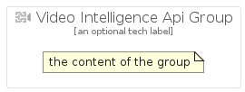

# VideoIntelligenceApi


```text
gcp/Item/VideoIntelligenceApi
```

```text
include('gcp/Item/VideoIntelligenceApi')
```


| Illustration | VideoIntelligenceApi | VideoIntelligenceApiCard | VideoIntelligenceApiGroup |
| :---: | :---: | :---: | :---: |
|  |  |  |  |


## VideoIntelligenceApi

### Load remotely
```plantuml
@startuml
' configures the library
!global $LIB_BASE_LOCATION="https://raw.githubusercontent.com/tmorin/plantuml-libs/master/distribution"

' loads the library's bootstrap
!include $LIB_BASE_LOCATION/bootstrap.puml

' loads the package bootstrap
include('gcp/bootstrap')

' loads the Item which embeds the element VideoIntelligenceApi
include('gcp/Item/VideoIntelligenceApi')

' renders the element
VideoIntelligenceApi('VideoIntelligenceApi', 'Video Intelligence Api', 'an optional tech label', 'an optional description')
@enduml
```

### Load locally
```plantuml
@startuml
' configures the library
!global $INCLUSION_MODE="local"
!global $LIB_BASE_LOCATION="../.."

' loads the library's bootstrap
!include $LIB_BASE_LOCATION/bootstrap.puml

' loads the package bootstrap
include('gcp/bootstrap')

' loads the Item which embeds the element VideoIntelligenceApi
include('gcp/Item/VideoIntelligenceApi')

' renders the element
VideoIntelligenceApi('VideoIntelligenceApi', 'Video Intelligence Api', 'an optional tech label', 'an optional description')
@enduml
```

## VideoIntelligenceApiCard

### Load remotely
```plantuml
@startuml
' configures the library
!global $LIB_BASE_LOCATION="https://raw.githubusercontent.com/tmorin/plantuml-libs/master/distribution"

' loads the library's bootstrap
!include $LIB_BASE_LOCATION/bootstrap.puml

' loads the package bootstrap
include('gcp/bootstrap')

' loads the Item which embeds the element VideoIntelligenceApiCard
include('gcp/Item/VideoIntelligenceApi')

' renders the element
VideoIntelligenceApiCard('VideoIntelligenceApiCard', 'Video Intelligence Api Card', 'an optional description')
@enduml
```

### Load locally
```plantuml
@startuml
' configures the library
!global $INCLUSION_MODE="local"
!global $LIB_BASE_LOCATION="../.."

' loads the library's bootstrap
!include $LIB_BASE_LOCATION/bootstrap.puml

' loads the package bootstrap
include('gcp/bootstrap')

' loads the Item which embeds the element VideoIntelligenceApiCard
include('gcp/Item/VideoIntelligenceApi')

' renders the element
VideoIntelligenceApiCard('VideoIntelligenceApiCard', 'Video Intelligence Api Card', 'an optional description')
@enduml
```

## VideoIntelligenceApiGroup

### Load remotely
```plantuml
@startuml
' configures the library
!global $LIB_BASE_LOCATION="https://raw.githubusercontent.com/tmorin/plantuml-libs/master/distribution"

' loads the library's bootstrap
!include $LIB_BASE_LOCATION/bootstrap.puml

' loads the package bootstrap
include('gcp/bootstrap')

' loads the Item which embeds the element VideoIntelligenceApiGroup
include('gcp/Item/VideoIntelligenceApi')

' renders the element
VideoIntelligenceApiGroup('VideoIntelligenceApiGroup', 'Video Intelligence Api Group', 'an optional tech label') {
    note as note
        the content of the group
    end note
}
@enduml
```

### Load locally
```plantuml
@startuml
' configures the library
!global $INCLUSION_MODE="local"
!global $LIB_BASE_LOCATION="../.."

' loads the library's bootstrap
!include $LIB_BASE_LOCATION/bootstrap.puml

' loads the package bootstrap
include('gcp/bootstrap')

' loads the Item which embeds the element VideoIntelligenceApiGroup
include('gcp/Item/VideoIntelligenceApi')

' renders the element
VideoIntelligenceApiGroup('VideoIntelligenceApiGroup', 'Video Intelligence Api Group', 'an optional tech label') {
    note as note
        the content of the group
    end note
}
@enduml
```

