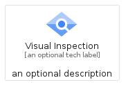
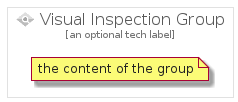

# VisualInspection


```text
gcp/Item/VisualInspection
```

```text
include('gcp/Item/VisualInspection')
```


| Illustration | VisualInspection | VisualInspectionCard | VisualInspectionGroup |
| :---: | :---: | :---: | :---: |
|  |  |  |  |


## VisualInspection

### Load remotely
```plantuml
@startuml
' configures the library
!global $LIB_BASE_LOCATION="https://raw.githubusercontent.com/tmorin/plantuml-libs/master/distribution"

' loads the library's bootstrap
!include $LIB_BASE_LOCATION/bootstrap.puml

' loads the package bootstrap
include('gcp/bootstrap')

' loads the Item which embeds the element VisualInspection
include('gcp/Item/VisualInspection')

' renders the element
VisualInspection('VisualInspection', 'Visual Inspection', 'an optional tech label', 'an optional description')
@enduml
```

### Load locally
```plantuml
@startuml
' configures the library
!global $INCLUSION_MODE="local"
!global $LIB_BASE_LOCATION="../.."

' loads the library's bootstrap
!include $LIB_BASE_LOCATION/bootstrap.puml

' loads the package bootstrap
include('gcp/bootstrap')

' loads the Item which embeds the element VisualInspection
include('gcp/Item/VisualInspection')

' renders the element
VisualInspection('VisualInspection', 'Visual Inspection', 'an optional tech label', 'an optional description')
@enduml
```

## VisualInspectionCard

### Load remotely
```plantuml
@startuml
' configures the library
!global $LIB_BASE_LOCATION="https://raw.githubusercontent.com/tmorin/plantuml-libs/master/distribution"

' loads the library's bootstrap
!include $LIB_BASE_LOCATION/bootstrap.puml

' loads the package bootstrap
include('gcp/bootstrap')

' loads the Item which embeds the element VisualInspectionCard
include('gcp/Item/VisualInspection')

' renders the element
VisualInspectionCard('VisualInspectionCard', 'Visual Inspection Card', 'an optional description')
@enduml
```

### Load locally
```plantuml
@startuml
' configures the library
!global $INCLUSION_MODE="local"
!global $LIB_BASE_LOCATION="../.."

' loads the library's bootstrap
!include $LIB_BASE_LOCATION/bootstrap.puml

' loads the package bootstrap
include('gcp/bootstrap')

' loads the Item which embeds the element VisualInspectionCard
include('gcp/Item/VisualInspection')

' renders the element
VisualInspectionCard('VisualInspectionCard', 'Visual Inspection Card', 'an optional description')
@enduml
```

## VisualInspectionGroup

### Load remotely
```plantuml
@startuml
' configures the library
!global $LIB_BASE_LOCATION="https://raw.githubusercontent.com/tmorin/plantuml-libs/master/distribution"

' loads the library's bootstrap
!include $LIB_BASE_LOCATION/bootstrap.puml

' loads the package bootstrap
include('gcp/bootstrap')

' loads the Item which embeds the element VisualInspectionGroup
include('gcp/Item/VisualInspection')

' renders the element
VisualInspectionGroup('VisualInspectionGroup', 'Visual Inspection Group', 'an optional tech label') {
    note as note
        the content of the group
    end note
}
@enduml
```

### Load locally
```plantuml
@startuml
' configures the library
!global $INCLUSION_MODE="local"
!global $LIB_BASE_LOCATION="../.."

' loads the library's bootstrap
!include $LIB_BASE_LOCATION/bootstrap.puml

' loads the package bootstrap
include('gcp/bootstrap')

' loads the Item which embeds the element VisualInspectionGroup
include('gcp/Item/VisualInspection')

' renders the element
VisualInspectionGroup('VisualInspectionGroup', 'Visual Inspection Group', 'an optional tech label') {
    note as note
        the content of the group
    end note
}
@enduml
```

