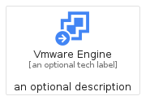
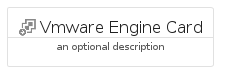

# VmwareEngine


```text
gcp/Item/VmwareEngine
```

```text
include('gcp/Item/VmwareEngine')
```


| Illustration | VmwareEngine | VmwareEngineCard | VmwareEngineGroup |
| :---: | :---: | :---: | :---: |
|  |  |  |  |


## VmwareEngine

### Load remotely
```plantuml
@startuml
' configures the library
!global $LIB_BASE_LOCATION="https://raw.githubusercontent.com/tmorin/plantuml-libs/master/distribution"

' loads the library's bootstrap
!include $LIB_BASE_LOCATION/bootstrap.puml

' loads the package bootstrap
include('gcp/bootstrap')

' loads the Item which embeds the element VmwareEngine
include('gcp/Item/VmwareEngine')

' renders the element
VmwareEngine('VmwareEngine', 'Vmware Engine', 'an optional tech label', 'an optional description')
@enduml
```

### Load locally
```plantuml
@startuml
' configures the library
!global $INCLUSION_MODE="local"
!global $LIB_BASE_LOCATION="../.."

' loads the library's bootstrap
!include $LIB_BASE_LOCATION/bootstrap.puml

' loads the package bootstrap
include('gcp/bootstrap')

' loads the Item which embeds the element VmwareEngine
include('gcp/Item/VmwareEngine')

' renders the element
VmwareEngine('VmwareEngine', 'Vmware Engine', 'an optional tech label', 'an optional description')
@enduml
```

## VmwareEngineCard

### Load remotely
```plantuml
@startuml
' configures the library
!global $LIB_BASE_LOCATION="https://raw.githubusercontent.com/tmorin/plantuml-libs/master/distribution"

' loads the library's bootstrap
!include $LIB_BASE_LOCATION/bootstrap.puml

' loads the package bootstrap
include('gcp/bootstrap')

' loads the Item which embeds the element VmwareEngineCard
include('gcp/Item/VmwareEngine')

' renders the element
VmwareEngineCard('VmwareEngineCard', 'Vmware Engine Card', 'an optional description')
@enduml
```

### Load locally
```plantuml
@startuml
' configures the library
!global $INCLUSION_MODE="local"
!global $LIB_BASE_LOCATION="../.."

' loads the library's bootstrap
!include $LIB_BASE_LOCATION/bootstrap.puml

' loads the package bootstrap
include('gcp/bootstrap')

' loads the Item which embeds the element VmwareEngineCard
include('gcp/Item/VmwareEngine')

' renders the element
VmwareEngineCard('VmwareEngineCard', 'Vmware Engine Card', 'an optional description')
@enduml
```

## VmwareEngineGroup

### Load remotely
```plantuml
@startuml
' configures the library
!global $LIB_BASE_LOCATION="https://raw.githubusercontent.com/tmorin/plantuml-libs/master/distribution"

' loads the library's bootstrap
!include $LIB_BASE_LOCATION/bootstrap.puml

' loads the package bootstrap
include('gcp/bootstrap')

' loads the Item which embeds the element VmwareEngineGroup
include('gcp/Item/VmwareEngine')

' renders the element
VmwareEngineGroup('VmwareEngineGroup', 'Vmware Engine Group', 'an optional tech label') {
    note as note
        the content of the group
    end note
}
@enduml
```

### Load locally
```plantuml
@startuml
' configures the library
!global $INCLUSION_MODE="local"
!global $LIB_BASE_LOCATION="../.."

' loads the library's bootstrap
!include $LIB_BASE_LOCATION/bootstrap.puml

' loads the package bootstrap
include('gcp/bootstrap')

' loads the Item which embeds the element VmwareEngineGroup
include('gcp/Item/VmwareEngine')

' renders the element
VmwareEngineGroup('VmwareEngineGroup', 'Vmware Engine Group', 'an optional tech label') {
    note as note
        the content of the group
    end note
}
@enduml
```

