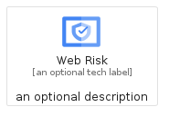
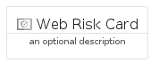
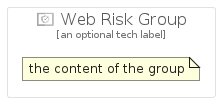

# WebRisk


```text
gcp/Item/WebRisk
```

```text
include('gcp/Item/WebRisk')
```


| Illustration | WebRisk | WebRiskCard | WebRiskGroup |
| :---: | :---: | :---: | :---: |
|  |  |  |  |


## WebRisk

### Load remotely
```plantuml
@startuml
' configures the library
!global $LIB_BASE_LOCATION="https://raw.githubusercontent.com/tmorin/plantuml-libs/master/distribution"

' loads the library's bootstrap
!include $LIB_BASE_LOCATION/bootstrap.puml

' loads the package bootstrap
include('gcp/bootstrap')

' loads the Item which embeds the element WebRisk
include('gcp/Item/WebRisk')

' renders the element
WebRisk('WebRisk', 'Web Risk', 'an optional tech label')
@enduml
```

### Load locally
```plantuml
@startuml
' configures the library
!global $INCLUSION_MODE="local"
!global $LIB_BASE_LOCATION="../.."

' loads the library's bootstrap
!include $LIB_BASE_LOCATION/bootstrap.puml

' loads the package bootstrap
include('gcp/bootstrap')

' loads the Item which embeds the element WebRisk
include('gcp/Item/WebRisk')

' renders the element
WebRisk('WebRisk', 'Web Risk', 'an optional tech label')
@enduml
```

## WebRiskCard

### Load remotely
```plantuml
@startuml
' configures the library
!global $LIB_BASE_LOCATION="https://raw.githubusercontent.com/tmorin/plantuml-libs/master/distribution"

' loads the library's bootstrap
!include $LIB_BASE_LOCATION/bootstrap.puml

' loads the package bootstrap
include('gcp/bootstrap')

' loads the Item which embeds the element WebRiskCard
include('gcp/Item/WebRisk')

' renders the element
WebRiskCard('WebRiskCard', 'Web Risk Card', 'an optional description')
@enduml
```

### Load locally
```plantuml
@startuml
' configures the library
!global $INCLUSION_MODE="local"
!global $LIB_BASE_LOCATION="../.."

' loads the library's bootstrap
!include $LIB_BASE_LOCATION/bootstrap.puml

' loads the package bootstrap
include('gcp/bootstrap')

' loads the Item which embeds the element WebRiskCard
include('gcp/Item/WebRisk')

' renders the element
WebRiskCard('WebRiskCard', 'Web Risk Card', 'an optional description')
@enduml
```

## WebRiskGroup

### Load remotely
```plantuml
@startuml
' configures the library
!global $LIB_BASE_LOCATION="https://raw.githubusercontent.com/tmorin/plantuml-libs/master/distribution"

' loads the library's bootstrap
!include $LIB_BASE_LOCATION/bootstrap.puml

' loads the package bootstrap
include('gcp/bootstrap')

' loads the Item which embeds the element WebRiskGroup
include('gcp/Item/WebRisk')

' renders the element
WebRiskGroup('WebRiskGroup', 'Web Risk Group', 'an optional tech label') {
    note as note
        the content of the group
    end note
}
@enduml
```

### Load locally
```plantuml
@startuml
' configures the library
!global $INCLUSION_MODE="local"
!global $LIB_BASE_LOCATION="../.."

' loads the library's bootstrap
!include $LIB_BASE_LOCATION/bootstrap.puml

' loads the package bootstrap
include('gcp/bootstrap')

' loads the Item which embeds the element WebRiskGroup
include('gcp/Item/WebRisk')

' renders the element
WebRiskGroup('WebRiskGroup', 'Web Risk Group', 'an optional tech label') {
    note as note
        the content of the group
    end note
}
@enduml
```

