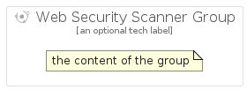

# WebSecurityScanner


```text
gcp/Item/WebSecurityScanner
```

```text
include('gcp/Item/WebSecurityScanner')
```


| Illustration | WebSecurityScanner | WebSecurityScannerCard | WebSecurityScannerGroup |
| :---: | :---: | :---: | :---: |
|  |  |  |  |


## Sprites
The item provides the following sriptes:

- `<$WebSecurityScannerXs>`
- `<$WebSecurityScannerSm>`
- `<$WebSecurityScannerMd>`
- `<$WebSecurityScannerLg>`


## WebSecurityScanner

### Load remotely
```plantuml
@startuml
' configures the library
!global $LIB_BASE_LOCATION="https://raw.githubusercontent.com/tmorin/plantuml-libs/master/distribution"

' loads the library's bootstrap
!include $LIB_BASE_LOCATION/bootstrap.puml

' loads the package bootstrap
include('gcp/bootstrap')

' loads the Item which embeds the element WebSecurityScanner
include('gcp/Item/WebSecurityScanner')

' renders the element
WebSecurityScanner('WebSecurityScanner', 'Web Security Scanner', 'an optional tech label', 'an optional description')
@enduml
```

### Load locally
```plantuml
@startuml
' configures the library
!global $INCLUSION_MODE="local"
!global $LIB_BASE_LOCATION="../.."

' loads the library's bootstrap
!include $LIB_BASE_LOCATION/bootstrap.puml

' loads the package bootstrap
include('gcp/bootstrap')

' loads the Item which embeds the element WebSecurityScanner
include('gcp/Item/WebSecurityScanner')

' renders the element
WebSecurityScanner('WebSecurityScanner', 'Web Security Scanner', 'an optional tech label', 'an optional description')
@enduml
```

## WebSecurityScannerCard

### Load remotely
```plantuml
@startuml
' configures the library
!global $LIB_BASE_LOCATION="https://raw.githubusercontent.com/tmorin/plantuml-libs/master/distribution"

' loads the library's bootstrap
!include $LIB_BASE_LOCATION/bootstrap.puml

' loads the package bootstrap
include('gcp/bootstrap')

' loads the Item which embeds the element WebSecurityScannerCard
include('gcp/Item/WebSecurityScanner')

' renders the element
WebSecurityScannerCard('WebSecurityScannerCard', 'Web Security Scanner Card', 'an optional description')
@enduml
```

### Load locally
```plantuml
@startuml
' configures the library
!global $INCLUSION_MODE="local"
!global $LIB_BASE_LOCATION="../.."

' loads the library's bootstrap
!include $LIB_BASE_LOCATION/bootstrap.puml

' loads the package bootstrap
include('gcp/bootstrap')

' loads the Item which embeds the element WebSecurityScannerCard
include('gcp/Item/WebSecurityScanner')

' renders the element
WebSecurityScannerCard('WebSecurityScannerCard', 'Web Security Scanner Card', 'an optional description')
@enduml
```

## WebSecurityScannerGroup

### Load remotely
```plantuml
@startuml
' configures the library
!global $LIB_BASE_LOCATION="https://raw.githubusercontent.com/tmorin/plantuml-libs/master/distribution"

' loads the library's bootstrap
!include $LIB_BASE_LOCATION/bootstrap.puml

' loads the package bootstrap
include('gcp/bootstrap')

' loads the Item which embeds the element WebSecurityScannerGroup
include('gcp/Item/WebSecurityScanner')

' renders the element
WebSecurityScannerGroup('WebSecurityScannerGroup', 'Web Security Scanner Group', 'an optional tech label') {
    note as note
        the content of the group
    end note
}
@enduml
```

### Load locally
```plantuml
@startuml
' configures the library
!global $INCLUSION_MODE="local"
!global $LIB_BASE_LOCATION="../.."

' loads the library's bootstrap
!include $LIB_BASE_LOCATION/bootstrap.puml

' loads the package bootstrap
include('gcp/bootstrap')

' loads the Item which embeds the element WebSecurityScannerGroup
include('gcp/Item/WebSecurityScanner')

' renders the element
WebSecurityScannerGroup('WebSecurityScannerGroup', 'Web Security Scanner Group', 'an optional tech label') {
    note as note
        the content of the group
    end note
}
@enduml
```

