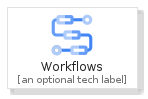

# Workflows


```text
gcp/Item/Workflows
```

```text
include('gcp/Item/Workflows')
```


| Illustration | Workflows | WorkflowsCard | WorkflowsGroup |
| :---: | :---: | :---: | :---: |
|  |  |  |  |


## Sprites
The item provides the following sriptes:

- `<$WorkflowsXs>`
- `<$WorkflowsSm>`
- `<$WorkflowsMd>`
- `<$WorkflowsLg>`


## Workflows

### Load remotely
```plantuml
@startuml
' configures the library
!global $LIB_BASE_LOCATION="https://raw.githubusercontent.com/tmorin/plantuml-libs/master/distribution"

' loads the library's bootstrap
!include $LIB_BASE_LOCATION/bootstrap.puml

' loads the package bootstrap
include('gcp/bootstrap')

' loads the Item which embeds the element Workflows
include('gcp/Item/Workflows')

' renders the element
Workflows('Workflows', 'Workflows', 'an optional tech label', 'an optional description')
@enduml
```

### Load locally
```plantuml
@startuml
' configures the library
!global $INCLUSION_MODE="local"
!global $LIB_BASE_LOCATION="../.."

' loads the library's bootstrap
!include $LIB_BASE_LOCATION/bootstrap.puml

' loads the package bootstrap
include('gcp/bootstrap')

' loads the Item which embeds the element Workflows
include('gcp/Item/Workflows')

' renders the element
Workflows('Workflows', 'Workflows', 'an optional tech label', 'an optional description')
@enduml
```

## WorkflowsCard

### Load remotely
```plantuml
@startuml
' configures the library
!global $LIB_BASE_LOCATION="https://raw.githubusercontent.com/tmorin/plantuml-libs/master/distribution"

' loads the library's bootstrap
!include $LIB_BASE_LOCATION/bootstrap.puml

' loads the package bootstrap
include('gcp/bootstrap')

' loads the Item which embeds the element WorkflowsCard
include('gcp/Item/Workflows')

' renders the element
WorkflowsCard('WorkflowsCard', 'Workflows Card', 'an optional description')
@enduml
```

### Load locally
```plantuml
@startuml
' configures the library
!global $INCLUSION_MODE="local"
!global $LIB_BASE_LOCATION="../.."

' loads the library's bootstrap
!include $LIB_BASE_LOCATION/bootstrap.puml

' loads the package bootstrap
include('gcp/bootstrap')

' loads the Item which embeds the element WorkflowsCard
include('gcp/Item/Workflows')

' renders the element
WorkflowsCard('WorkflowsCard', 'Workflows Card', 'an optional description')
@enduml
```

## WorkflowsGroup

### Load remotely
```plantuml
@startuml
' configures the library
!global $LIB_BASE_LOCATION="https://raw.githubusercontent.com/tmorin/plantuml-libs/master/distribution"

' loads the library's bootstrap
!include $LIB_BASE_LOCATION/bootstrap.puml

' loads the package bootstrap
include('gcp/bootstrap')

' loads the Item which embeds the element WorkflowsGroup
include('gcp/Item/Workflows')

' renders the element
WorkflowsGroup('WorkflowsGroup', 'Workflows Group', 'an optional tech label') {
    note as note
        the content of the group
    end note
}
@enduml
```

### Load locally
```plantuml
@startuml
' configures the library
!global $INCLUSION_MODE="local"
!global $LIB_BASE_LOCATION="../.."

' loads the library's bootstrap
!include $LIB_BASE_LOCATION/bootstrap.puml

' loads the package bootstrap
include('gcp/bootstrap')

' loads the Item which embeds the element WorkflowsGroup
include('gcp/Item/Workflows')

' renders the element
WorkflowsGroup('WorkflowsGroup', 'Workflows Group', 'an optional tech label') {
    note as note
        the content of the group
    end note
}
@enduml
```

