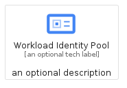
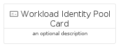
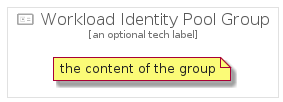

# WorkloadIdentityPool


```text
gcp/Item/WorkloadIdentityPool
```

```text
include('gcp/Item/WorkloadIdentityPool')
```


| Illustration | WorkloadIdentityPool | WorkloadIdentityPoolCard | WorkloadIdentityPoolGroup |
| :---: | :---: | :---: | :---: |
|  |  |  |  |


## WorkloadIdentityPool

### Load remotely
```plantuml
@startuml
' configures the library
!global $LIB_BASE_LOCATION="https://raw.githubusercontent.com/tmorin/plantuml-libs/master/distribution"

' loads the library's bootstrap
!include $LIB_BASE_LOCATION/bootstrap.puml

' loads the package bootstrap
include('gcp/bootstrap')

' loads the Item which embeds the element WorkloadIdentityPool
include('gcp/Item/WorkloadIdentityPool')

' renders the element
WorkloadIdentityPool('WorkloadIdentityPool', 'Workload Identity Pool', 'an optional tech label')
@enduml
```

### Load locally
```plantuml
@startuml
' configures the library
!global $INCLUSION_MODE="local"
!global $LIB_BASE_LOCATION="../.."

' loads the library's bootstrap
!include $LIB_BASE_LOCATION/bootstrap.puml

' loads the package bootstrap
include('gcp/bootstrap')

' loads the Item which embeds the element WorkloadIdentityPool
include('gcp/Item/WorkloadIdentityPool')

' renders the element
WorkloadIdentityPool('WorkloadIdentityPool', 'Workload Identity Pool', 'an optional tech label')
@enduml
```

## WorkloadIdentityPoolCard

### Load remotely
```plantuml
@startuml
' configures the library
!global $LIB_BASE_LOCATION="https://raw.githubusercontent.com/tmorin/plantuml-libs/master/distribution"

' loads the library's bootstrap
!include $LIB_BASE_LOCATION/bootstrap.puml

' loads the package bootstrap
include('gcp/bootstrap')

' loads the Item which embeds the element WorkloadIdentityPoolCard
include('gcp/Item/WorkloadIdentityPool')

' renders the element
WorkloadIdentityPoolCard('WorkloadIdentityPoolCard', 'Workload Identity Pool Card', 'an optional description')
@enduml
```

### Load locally
```plantuml
@startuml
' configures the library
!global $INCLUSION_MODE="local"
!global $LIB_BASE_LOCATION="../.."

' loads the library's bootstrap
!include $LIB_BASE_LOCATION/bootstrap.puml

' loads the package bootstrap
include('gcp/bootstrap')

' loads the Item which embeds the element WorkloadIdentityPoolCard
include('gcp/Item/WorkloadIdentityPool')

' renders the element
WorkloadIdentityPoolCard('WorkloadIdentityPoolCard', 'Workload Identity Pool Card', 'an optional description')
@enduml
```

## WorkloadIdentityPoolGroup

### Load remotely
```plantuml
@startuml
' configures the library
!global $LIB_BASE_LOCATION="https://raw.githubusercontent.com/tmorin/plantuml-libs/master/distribution"

' loads the library's bootstrap
!include $LIB_BASE_LOCATION/bootstrap.puml

' loads the package bootstrap
include('gcp/bootstrap')

' loads the Item which embeds the element WorkloadIdentityPoolGroup
include('gcp/Item/WorkloadIdentityPool')

' renders the element
WorkloadIdentityPoolGroup('WorkloadIdentityPoolGroup', 'Workload Identity Pool Group', 'an optional tech label') {
    note as note
        the content of the group
    end note
}
@enduml
```

### Load locally
```plantuml
@startuml
' configures the library
!global $INCLUSION_MODE="local"
!global $LIB_BASE_LOCATION="../.."

' loads the library's bootstrap
!include $LIB_BASE_LOCATION/bootstrap.puml

' loads the package bootstrap
include('gcp/bootstrap')

' loads the Item which embeds the element WorkloadIdentityPoolGroup
include('gcp/Item/WorkloadIdentityPool')

' renders the element
WorkloadIdentityPoolGroup('WorkloadIdentityPoolGroup', 'Workload Identity Pool Group', 'an optional tech label') {
    note as note
        the content of the group
    end note
}
@enduml
```

