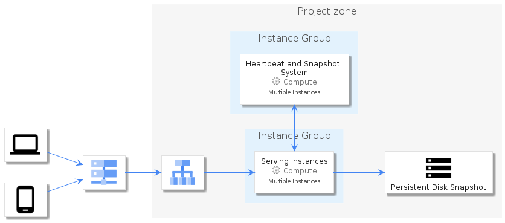

# gcp

## Usage

### Bootstrap

The bootstrap may provide PlantUML artifacts like constants, procedures or style statements.

```plantuml
' loads the gcp bootstrap
include('gcp/bootstrap')
```

### Full inclusion

An additional include can be used to load all items in one shot.

 ```plantuml
' loads the bootstrap of `gcp` and all related items
include('gcp/full')
```

### Single inclusion

Finally, another include can be used to load the library's bootstrap, the package's bootstrap and all items' resources in one `!include` statement.

Include remotely the resources:
```plantuml
' loads the library, the bootstrap of `gcp` and all related items
!include https://raw.githubusercontent.com/tmorin/plantuml-libs/master/distribution/gcp/single.puml
```

Include locally the resources:
```plantuml
' configures the library
!global $INCLUSION_MODE="local"
' loads the library, the bootstrap of `gcp` and all related items
!include <the relative path to the /distribution directory>/gcp/single.puml
```


# Modules

The package provides 2 modules.

- [gcp/Item](../gcp/Item/README.md) with 216 items
- [gcp/Group](../gcp/Group/README.md) with 22 items


# Examples

The package provides 1 examples.

## Diagram Elements Overview

<br>
[The source file.](../gcp/diagram_elements_overview.puml)


