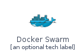
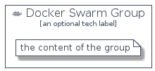

# DockerSwarm


```text
homecloud-1/Brand/DockerSwarm
```

```text
include('homecloud-1/Brand/DockerSwarm')
```


| Illustration | DockerSwarm | DockerSwarmCard | DockerSwarmGroup |
| :---: | :---: | :---: | :---: |
|  |  |  |  |


## DockerSwarm

### Load remotely
```plantuml
@startuml
' configures the library
!global $LIB_BASE_LOCATION="https://github.com/tmorin/plantuml-libs/distribution"

' loads the library's bootstrap
!include $LIB_BASE_LOCATION/bootstrap.puml

' loads the package bootstrap
include('homecloud-1/bootstrap')

' loads the Item which embeds the element DockerSwarm
include('homecloud-1/Brand/DockerSwarm')

' renders the element
DockerSwarm('DockerSwarm', 'Docker Swarm', 'an optional tech label')
@enduml
```

### Load locally
```plantuml
@startuml
' configures the library
!global $INCLUSION_MODE="local"
!global $LIB_BASE_LOCATION="../.."

' loads the library's bootstrap
!include $LIB_BASE_LOCATION/bootstrap.puml

' loads the package bootstrap
include('homecloud-1/bootstrap')

' loads the Item which embeds the element DockerSwarm
include('homecloud-1/Brand/DockerSwarm')

' renders the element
DockerSwarm('DockerSwarm', 'Docker Swarm', 'an optional tech label')
@enduml
```

## DockerSwarmCard

### Load remotely
```plantuml
@startuml
' configures the library
!global $LIB_BASE_LOCATION="https://github.com/tmorin/plantuml-libs/distribution"

' loads the library's bootstrap
!include $LIB_BASE_LOCATION/bootstrap.puml

' loads the package bootstrap
include('homecloud-1/bootstrap')

' loads the Item which embeds the element DockerSwarmCard
include('homecloud-1/Brand/DockerSwarm')

' renders the element
DockerSwarmCard('DockerSwarmCard', 'Docker Swarm Card', 'an optional description')
@enduml
```

### Load locally
```plantuml
@startuml
' configures the library
!global $INCLUSION_MODE="local"
!global $LIB_BASE_LOCATION="../.."

' loads the library's bootstrap
!include $LIB_BASE_LOCATION/bootstrap.puml

' loads the package bootstrap
include('homecloud-1/bootstrap')

' loads the Item which embeds the element DockerSwarmCard
include('homecloud-1/Brand/DockerSwarm')

' renders the element
DockerSwarmCard('DockerSwarmCard', 'Docker Swarm Card', 'an optional description')
@enduml
```

## DockerSwarmGroup

### Load remotely
```plantuml
@startuml
' configures the library
!global $LIB_BASE_LOCATION="https://github.com/tmorin/plantuml-libs/distribution"

' loads the library's bootstrap
!include $LIB_BASE_LOCATION/bootstrap.puml

' loads the package bootstrap
include('homecloud-1/bootstrap')

' loads the Item which embeds the element DockerSwarmGroup
include('homecloud-1/Brand/DockerSwarm')

' renders the element
DockerSwarmGroup('DockerSwarmGroup', 'Docker Swarm Group', 'an optional tech label') {
    note as note
        the content of the group
    end note
}
@enduml
```

### Load locally
```plantuml
@startuml
' configures the library
!global $INCLUSION_MODE="local"
!global $LIB_BASE_LOCATION="../.."

' loads the library's bootstrap
!include $LIB_BASE_LOCATION/bootstrap.puml

' loads the package bootstrap
include('homecloud-1/bootstrap')

' loads the Item which embeds the element DockerSwarmGroup
include('homecloud-1/Brand/DockerSwarm')

' renders the element
DockerSwarmGroup('DockerSwarmGroup', 'Docker Swarm Group', 'an optional tech label') {
    note as note
        the content of the group
    end note
}
@enduml
```

