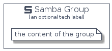

# Samba


```text
homecloud-1/Brand/Samba
```

```text
include('homecloud-1/Brand/Samba')
```


| Illustration | Samba | SambaCard | SambaGroup |
| :---: | :---: | :---: | :---: |
|  |  |  |  |


## Samba

### Load remotely
```plantuml
@startuml
' configures the library
!global $LIB_BASE_LOCATION="https://github.com/tmorin/plantuml-libs/distribution"

' loads the library's bootstrap
!include $LIB_BASE_LOCATION/bootstrap.puml

' loads the package bootstrap
include('homecloud-1/bootstrap')

' loads the Item which embeds the element Samba
include('homecloud-1/Brand/Samba')

' renders the element
Samba('Samba', 'Samba', 'an optional tech label')
@enduml
```

### Load locally
```plantuml
@startuml
' configures the library
!global $INCLUSION_MODE="local"
!global $LIB_BASE_LOCATION="../.."

' loads the library's bootstrap
!include $LIB_BASE_LOCATION/bootstrap.puml

' loads the package bootstrap
include('homecloud-1/bootstrap')

' loads the Item which embeds the element Samba
include('homecloud-1/Brand/Samba')

' renders the element
Samba('Samba', 'Samba', 'an optional tech label')
@enduml
```

## SambaCard

### Load remotely
```plantuml
@startuml
' configures the library
!global $LIB_BASE_LOCATION="https://github.com/tmorin/plantuml-libs/distribution"

' loads the library's bootstrap
!include $LIB_BASE_LOCATION/bootstrap.puml

' loads the package bootstrap
include('homecloud-1/bootstrap')

' loads the Item which embeds the element SambaCard
include('homecloud-1/Brand/Samba')

' renders the element
SambaCard('SambaCard', 'Samba Card', 'an optional description')
@enduml
```

### Load locally
```plantuml
@startuml
' configures the library
!global $INCLUSION_MODE="local"
!global $LIB_BASE_LOCATION="../.."

' loads the library's bootstrap
!include $LIB_BASE_LOCATION/bootstrap.puml

' loads the package bootstrap
include('homecloud-1/bootstrap')

' loads the Item which embeds the element SambaCard
include('homecloud-1/Brand/Samba')

' renders the element
SambaCard('SambaCard', 'Samba Card', 'an optional description')
@enduml
```

## SambaGroup

### Load remotely
```plantuml
@startuml
' configures the library
!global $LIB_BASE_LOCATION="https://github.com/tmorin/plantuml-libs/distribution"

' loads the library's bootstrap
!include $LIB_BASE_LOCATION/bootstrap.puml

' loads the package bootstrap
include('homecloud-1/bootstrap')

' loads the Item which embeds the element SambaGroup
include('homecloud-1/Brand/Samba')

' renders the element
SambaGroup('SambaGroup', 'Samba Group', 'an optional tech label') {
    note as note
        the content of the group
    end note
}
@enduml
```

### Load locally
```plantuml
@startuml
' configures the library
!global $INCLUSION_MODE="local"
!global $LIB_BASE_LOCATION="../.."

' loads the library's bootstrap
!include $LIB_BASE_LOCATION/bootstrap.puml

' loads the package bootstrap
include('homecloud-1/bootstrap')

' loads the Item which embeds the element SambaGroup
include('homecloud-1/Brand/Samba')

' renders the element
SambaGroup('SambaGroup', 'Samba Group', 'an optional tech label') {
    note as note
        the content of the group
    end note
}
@enduml
```

