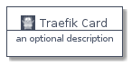
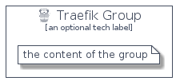

# Traefik


```text
homecloud-1/Brand/Traefik
```

```text
include('homecloud-1/Brand/Traefik')
```


| Illustration | Traefik | TraefikCard | TraefikGroup |
| :---: | :---: | :---: | :---: |
|  |  |  |  |


## Traefik

### Load remotely
```plantuml
@startuml
' configures the library
!global $LIB_BASE_LOCATION="https://github.com/tmorin/plantuml-libs/distribution"

' loads the library's bootstrap
!include $LIB_BASE_LOCATION/bootstrap.puml

' loads the package bootstrap
include('homecloud-1/bootstrap')

' loads the Item which embeds the element Traefik
include('homecloud-1/Brand/Traefik')

' renders the element
Traefik('Traefik', 'Traefik', 'an optional tech label')
@enduml
```

### Load locally
```plantuml
@startuml
' configures the library
!global $INCLUSION_MODE="local"
!global $LIB_BASE_LOCATION="../.."

' loads the library's bootstrap
!include $LIB_BASE_LOCATION/bootstrap.puml

' loads the package bootstrap
include('homecloud-1/bootstrap')

' loads the Item which embeds the element Traefik
include('homecloud-1/Brand/Traefik')

' renders the element
Traefik('Traefik', 'Traefik', 'an optional tech label')
@enduml
```

## TraefikCard

### Load remotely
```plantuml
@startuml
' configures the library
!global $LIB_BASE_LOCATION="https://github.com/tmorin/plantuml-libs/distribution"

' loads the library's bootstrap
!include $LIB_BASE_LOCATION/bootstrap.puml

' loads the package bootstrap
include('homecloud-1/bootstrap')

' loads the Item which embeds the element TraefikCard
include('homecloud-1/Brand/Traefik')

' renders the element
TraefikCard('TraefikCard', 'Traefik Card', 'an optional description')
@enduml
```

### Load locally
```plantuml
@startuml
' configures the library
!global $INCLUSION_MODE="local"
!global $LIB_BASE_LOCATION="../.."

' loads the library's bootstrap
!include $LIB_BASE_LOCATION/bootstrap.puml

' loads the package bootstrap
include('homecloud-1/bootstrap')

' loads the Item which embeds the element TraefikCard
include('homecloud-1/Brand/Traefik')

' renders the element
TraefikCard('TraefikCard', 'Traefik Card', 'an optional description')
@enduml
```

## TraefikGroup

### Load remotely
```plantuml
@startuml
' configures the library
!global $LIB_BASE_LOCATION="https://github.com/tmorin/plantuml-libs/distribution"

' loads the library's bootstrap
!include $LIB_BASE_LOCATION/bootstrap.puml

' loads the package bootstrap
include('homecloud-1/bootstrap')

' loads the Item which embeds the element TraefikGroup
include('homecloud-1/Brand/Traefik')

' renders the element
TraefikGroup('TraefikGroup', 'Traefik Group', 'an optional tech label') {
    note as note
        the content of the group
    end note
}
@enduml
```

### Load locally
```plantuml
@startuml
' configures the library
!global $INCLUSION_MODE="local"
!global $LIB_BASE_LOCATION="../.."

' loads the library's bootstrap
!include $LIB_BASE_LOCATION/bootstrap.puml

' loads the package bootstrap
include('homecloud-1/bootstrap')

' loads the Item which embeds the element TraefikGroup
include('homecloud-1/Brand/Traefik')

' renders the element
TraefikGroup('TraefikGroup', 'Traefik Group', 'an optional tech label') {
    note as note
        the content of the group
    end note
}
@enduml
```

