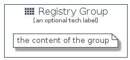

# Registry


```text
homecloud-1/Container/Registry
```

```text
include('homecloud-1/Container/Registry')
```


| Illustration | Registry | RegistryCard | RegistryGroup |
| :---: | :---: | :---: | :---: |
|  |  |  |  |


## Registry

### Load remotely
```plantuml
@startuml
' configures the library
!global $LIB_BASE_LOCATION="https://github.com/tmorin/plantuml-libs/distribution"

' loads the library's bootstrap
!include $LIB_BASE_LOCATION/bootstrap.puml

' loads the package bootstrap
include('homecloud-1/bootstrap')

' loads the Item which embeds the element Registry
include('homecloud-1/Container/Registry')

' renders the element
Registry('Registry', 'Registry', 'an optional tech label')
@enduml
```

### Load locally
```plantuml
@startuml
' configures the library
!global $INCLUSION_MODE="local"
!global $LIB_BASE_LOCATION="../.."

' loads the library's bootstrap
!include $LIB_BASE_LOCATION/bootstrap.puml

' loads the package bootstrap
include('homecloud-1/bootstrap')

' loads the Item which embeds the element Registry
include('homecloud-1/Container/Registry')

' renders the element
Registry('Registry', 'Registry', 'an optional tech label')
@enduml
```

## RegistryCard

### Load remotely
```plantuml
@startuml
' configures the library
!global $LIB_BASE_LOCATION="https://github.com/tmorin/plantuml-libs/distribution"

' loads the library's bootstrap
!include $LIB_BASE_LOCATION/bootstrap.puml

' loads the package bootstrap
include('homecloud-1/bootstrap')

' loads the Item which embeds the element RegistryCard
include('homecloud-1/Container/Registry')

' renders the element
RegistryCard('RegistryCard', 'Registry Card', 'an optional description')
@enduml
```

### Load locally
```plantuml
@startuml
' configures the library
!global $INCLUSION_MODE="local"
!global $LIB_BASE_LOCATION="../.."

' loads the library's bootstrap
!include $LIB_BASE_LOCATION/bootstrap.puml

' loads the package bootstrap
include('homecloud-1/bootstrap')

' loads the Item which embeds the element RegistryCard
include('homecloud-1/Container/Registry')

' renders the element
RegistryCard('RegistryCard', 'Registry Card', 'an optional description')
@enduml
```

## RegistryGroup

### Load remotely
```plantuml
@startuml
' configures the library
!global $LIB_BASE_LOCATION="https://github.com/tmorin/plantuml-libs/distribution"

' loads the library's bootstrap
!include $LIB_BASE_LOCATION/bootstrap.puml

' loads the package bootstrap
include('homecloud-1/bootstrap')

' loads the Item which embeds the element RegistryGroup
include('homecloud-1/Container/Registry')

' renders the element
RegistryGroup('RegistryGroup', 'Registry Group', 'an optional tech label') {
    note as note
        the content of the group
    end note
}
@enduml
```

### Load locally
```plantuml
@startuml
' configures the library
!global $INCLUSION_MODE="local"
!global $LIB_BASE_LOCATION="../.."

' loads the library's bootstrap
!include $LIB_BASE_LOCATION/bootstrap.puml

' loads the package bootstrap
include('homecloud-1/bootstrap')

' loads the Item which embeds the element RegistryGroup
include('homecloud-1/Container/Registry')

' renders the element
RegistryGroup('RegistryGroup', 'Registry Group', 'an optional tech label') {
    note as note
        the content of the group
    end note
}
@enduml
```

