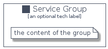

# Service


```text
homecloud-1/Container/Service
```

```text
include('homecloud-1/Container/Service')
```


| Illustration | Service | ServiceCard | ServiceGroup |
| :---: | :---: | :---: | :---: |
|  |  |  |  |


## Service

### Load remotely
```plantuml
@startuml
' configures the library
!global $LIB_BASE_LOCATION="https://github.com/tmorin/plantuml-libs/distribution"

' loads the library's bootstrap
!include $LIB_BASE_LOCATION/bootstrap.puml

' loads the package bootstrap
include('homecloud-1/bootstrap')

' loads the Item which embeds the element Service
include('homecloud-1/Container/Service')

' renders the element
Service('Service', 'Service', 'an optional tech label')
@enduml
```

### Load locally
```plantuml
@startuml
' configures the library
!global $INCLUSION_MODE="local"
!global $LIB_BASE_LOCATION="../.."

' loads the library's bootstrap
!include $LIB_BASE_LOCATION/bootstrap.puml

' loads the package bootstrap
include('homecloud-1/bootstrap')

' loads the Item which embeds the element Service
include('homecloud-1/Container/Service')

' renders the element
Service('Service', 'Service', 'an optional tech label')
@enduml
```

## ServiceCard

### Load remotely
```plantuml
@startuml
' configures the library
!global $LIB_BASE_LOCATION="https://github.com/tmorin/plantuml-libs/distribution"

' loads the library's bootstrap
!include $LIB_BASE_LOCATION/bootstrap.puml

' loads the package bootstrap
include('homecloud-1/bootstrap')

' loads the Item which embeds the element ServiceCard
include('homecloud-1/Container/Service')

' renders the element
ServiceCard('ServiceCard', 'Service Card', 'an optional description')
@enduml
```

### Load locally
```plantuml
@startuml
' configures the library
!global $INCLUSION_MODE="local"
!global $LIB_BASE_LOCATION="../.."

' loads the library's bootstrap
!include $LIB_BASE_LOCATION/bootstrap.puml

' loads the package bootstrap
include('homecloud-1/bootstrap')

' loads the Item which embeds the element ServiceCard
include('homecloud-1/Container/Service')

' renders the element
ServiceCard('ServiceCard', 'Service Card', 'an optional description')
@enduml
```

## ServiceGroup

### Load remotely
```plantuml
@startuml
' configures the library
!global $LIB_BASE_LOCATION="https://github.com/tmorin/plantuml-libs/distribution"

' loads the library's bootstrap
!include $LIB_BASE_LOCATION/bootstrap.puml

' loads the package bootstrap
include('homecloud-1/bootstrap')

' loads the Item which embeds the element ServiceGroup
include('homecloud-1/Container/Service')

' renders the element
ServiceGroup('ServiceGroup', 'Service Group', 'an optional tech label') {
    note as note
        the content of the group
    end note
}
@enduml
```

### Load locally
```plantuml
@startuml
' configures the library
!global $INCLUSION_MODE="local"
!global $LIB_BASE_LOCATION="../.."

' loads the library's bootstrap
!include $LIB_BASE_LOCATION/bootstrap.puml

' loads the package bootstrap
include('homecloud-1/bootstrap')

' loads the Item which embeds the element ServiceGroup
include('homecloud-1/Container/Service')

' renders the element
ServiceGroup('ServiceGroup', 'Service Group', 'an optional tech label') {
    note as note
        the content of the group
    end note
}
@enduml
```

