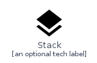

# Stack


```text
homecloud-1/Container/Stack
```

```text
include('homecloud-1/Container/Stack')
```


| Illustration | Stack | StackCard | StackGroup |
| :---: | :---: | :---: | :---: |
|  |  |  |  |


## Stack

### Load remotely
```plantuml
@startuml
' configures the library
!global $LIB_BASE_LOCATION="https://github.com/tmorin/plantuml-libs/distribution"

' loads the library's bootstrap
!include $LIB_BASE_LOCATION/bootstrap.puml

' loads the package bootstrap
include('homecloud-1/bootstrap')

' loads the Item which embeds the element Stack
include('homecloud-1/Container/Stack')

' renders the element
Stack('Stack', 'Stack', 'an optional tech label')
@enduml
```

### Load locally
```plantuml
@startuml
' configures the library
!global $INCLUSION_MODE="local"
!global $LIB_BASE_LOCATION="../.."

' loads the library's bootstrap
!include $LIB_BASE_LOCATION/bootstrap.puml

' loads the package bootstrap
include('homecloud-1/bootstrap')

' loads the Item which embeds the element Stack
include('homecloud-1/Container/Stack')

' renders the element
Stack('Stack', 'Stack', 'an optional tech label')
@enduml
```

## StackCard

### Load remotely
```plantuml
@startuml
' configures the library
!global $LIB_BASE_LOCATION="https://github.com/tmorin/plantuml-libs/distribution"

' loads the library's bootstrap
!include $LIB_BASE_LOCATION/bootstrap.puml

' loads the package bootstrap
include('homecloud-1/bootstrap')

' loads the Item which embeds the element StackCard
include('homecloud-1/Container/Stack')

' renders the element
StackCard('StackCard', 'Stack Card', 'an optional description')
@enduml
```

### Load locally
```plantuml
@startuml
' configures the library
!global $INCLUSION_MODE="local"
!global $LIB_BASE_LOCATION="../.."

' loads the library's bootstrap
!include $LIB_BASE_LOCATION/bootstrap.puml

' loads the package bootstrap
include('homecloud-1/bootstrap')

' loads the Item which embeds the element StackCard
include('homecloud-1/Container/Stack')

' renders the element
StackCard('StackCard', 'Stack Card', 'an optional description')
@enduml
```

## StackGroup

### Load remotely
```plantuml
@startuml
' configures the library
!global $LIB_BASE_LOCATION="https://github.com/tmorin/plantuml-libs/distribution"

' loads the library's bootstrap
!include $LIB_BASE_LOCATION/bootstrap.puml

' loads the package bootstrap
include('homecloud-1/bootstrap')

' loads the Item which embeds the element StackGroup
include('homecloud-1/Container/Stack')

' renders the element
StackGroup('StackGroup', 'Stack Group', 'an optional tech label') {
    note as note
        the content of the group
    end note
}
@enduml
```

### Load locally
```plantuml
@startuml
' configures the library
!global $INCLUSION_MODE="local"
!global $LIB_BASE_LOCATION="../.."

' loads the library's bootstrap
!include $LIB_BASE_LOCATION/bootstrap.puml

' loads the package bootstrap
include('homecloud-1/bootstrap')

' loads the Item which embeds the element StackGroup
include('homecloud-1/Container/Stack')

' renders the element
StackGroup('StackGroup', 'Stack Group', 'an optional tech label') {
    note as note
        the content of the group
    end note
}
@enduml
```

