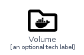
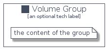

# Volume


```text
homecloud-1/Container/Volume
```

```text
include('homecloud-1/Container/Volume')
```


| Illustration | Volume | VolumeCard | VolumeGroup |
| :---: | :---: | :---: | :---: |
|  |  |  |  |


## Volume

### Load remotely
```plantuml
@startuml
' configures the library
!global $LIB_BASE_LOCATION="https://github.com/tmorin/plantuml-libs/distribution"

' loads the library's bootstrap
!include $LIB_BASE_LOCATION/bootstrap.puml

' loads the package bootstrap
include('homecloud-1/bootstrap')

' loads the Item which embeds the element Volume
include('homecloud-1/Container/Volume')

' renders the element
Volume('Volume', 'Volume', 'an optional tech label')
@enduml
```

### Load locally
```plantuml
@startuml
' configures the library
!global $INCLUSION_MODE="local"
!global $LIB_BASE_LOCATION="../.."

' loads the library's bootstrap
!include $LIB_BASE_LOCATION/bootstrap.puml

' loads the package bootstrap
include('homecloud-1/bootstrap')

' loads the Item which embeds the element Volume
include('homecloud-1/Container/Volume')

' renders the element
Volume('Volume', 'Volume', 'an optional tech label')
@enduml
```

## VolumeCard

### Load remotely
```plantuml
@startuml
' configures the library
!global $LIB_BASE_LOCATION="https://github.com/tmorin/plantuml-libs/distribution"

' loads the library's bootstrap
!include $LIB_BASE_LOCATION/bootstrap.puml

' loads the package bootstrap
include('homecloud-1/bootstrap')

' loads the Item which embeds the element VolumeCard
include('homecloud-1/Container/Volume')

' renders the element
VolumeCard('VolumeCard', 'Volume Card', 'an optional description')
@enduml
```

### Load locally
```plantuml
@startuml
' configures the library
!global $INCLUSION_MODE="local"
!global $LIB_BASE_LOCATION="../.."

' loads the library's bootstrap
!include $LIB_BASE_LOCATION/bootstrap.puml

' loads the package bootstrap
include('homecloud-1/bootstrap')

' loads the Item which embeds the element VolumeCard
include('homecloud-1/Container/Volume')

' renders the element
VolumeCard('VolumeCard', 'Volume Card', 'an optional description')
@enduml
```

## VolumeGroup

### Load remotely
```plantuml
@startuml
' configures the library
!global $LIB_BASE_LOCATION="https://github.com/tmorin/plantuml-libs/distribution"

' loads the library's bootstrap
!include $LIB_BASE_LOCATION/bootstrap.puml

' loads the package bootstrap
include('homecloud-1/bootstrap')

' loads the Item which embeds the element VolumeGroup
include('homecloud-1/Container/Volume')

' renders the element
VolumeGroup('VolumeGroup', 'Volume Group', 'an optional tech label') {
    note as note
        the content of the group
    end note
}
@enduml
```

### Load locally
```plantuml
@startuml
' configures the library
!global $INCLUSION_MODE="local"
!global $LIB_BASE_LOCATION="../.."

' loads the library's bootstrap
!include $LIB_BASE_LOCATION/bootstrap.puml

' loads the package bootstrap
include('homecloud-1/bootstrap')

' loads the Item which embeds the element VolumeGroup
include('homecloud-1/Container/Volume')

' renders the element
VolumeGroup('VolumeGroup', 'Volume Group', 'an optional tech label') {
    note as note
        the content of the group
    end note
}
@enduml
```

