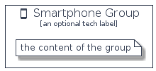

# Smartphone


```text
homecloud-1/Hardware/Smartphone
```

```text
include('homecloud-1/Hardware/Smartphone')
```


| Illustration | Smartphone | SmartphoneCard | SmartphoneGroup |
| :---: | :---: | :---: | :---: |
|  |  |  |  |


## Smartphone

### Load remotely
```plantuml
@startuml
' configures the library
!global $LIB_BASE_LOCATION="https://github.com/tmorin/plantuml-libs/distribution"

' loads the library's bootstrap
!include $LIB_BASE_LOCATION/bootstrap.puml

' loads the package bootstrap
include('homecloud-1/bootstrap')

' loads the Item which embeds the element Smartphone
include('homecloud-1/Hardware/Smartphone')

' renders the element
Smartphone('Smartphone', 'Smartphone', 'an optional tech label')
@enduml
```

### Load locally
```plantuml
@startuml
' configures the library
!global $INCLUSION_MODE="local"
!global $LIB_BASE_LOCATION="../.."

' loads the library's bootstrap
!include $LIB_BASE_LOCATION/bootstrap.puml

' loads the package bootstrap
include('homecloud-1/bootstrap')

' loads the Item which embeds the element Smartphone
include('homecloud-1/Hardware/Smartphone')

' renders the element
Smartphone('Smartphone', 'Smartphone', 'an optional tech label')
@enduml
```

## SmartphoneCard

### Load remotely
```plantuml
@startuml
' configures the library
!global $LIB_BASE_LOCATION="https://github.com/tmorin/plantuml-libs/distribution"

' loads the library's bootstrap
!include $LIB_BASE_LOCATION/bootstrap.puml

' loads the package bootstrap
include('homecloud-1/bootstrap')

' loads the Item which embeds the element SmartphoneCard
include('homecloud-1/Hardware/Smartphone')

' renders the element
SmartphoneCard('SmartphoneCard', 'Smartphone Card', 'an optional description')
@enduml
```

### Load locally
```plantuml
@startuml
' configures the library
!global $INCLUSION_MODE="local"
!global $LIB_BASE_LOCATION="../.."

' loads the library's bootstrap
!include $LIB_BASE_LOCATION/bootstrap.puml

' loads the package bootstrap
include('homecloud-1/bootstrap')

' loads the Item which embeds the element SmartphoneCard
include('homecloud-1/Hardware/Smartphone')

' renders the element
SmartphoneCard('SmartphoneCard', 'Smartphone Card', 'an optional description')
@enduml
```

## SmartphoneGroup

### Load remotely
```plantuml
@startuml
' configures the library
!global $LIB_BASE_LOCATION="https://github.com/tmorin/plantuml-libs/distribution"

' loads the library's bootstrap
!include $LIB_BASE_LOCATION/bootstrap.puml

' loads the package bootstrap
include('homecloud-1/bootstrap')

' loads the Item which embeds the element SmartphoneGroup
include('homecloud-1/Hardware/Smartphone')

' renders the element
SmartphoneGroup('SmartphoneGroup', 'Smartphone Group', 'an optional tech label') {
    note as note
        the content of the group
    end note
}
@enduml
```

### Load locally
```plantuml
@startuml
' configures the library
!global $INCLUSION_MODE="local"
!global $LIB_BASE_LOCATION="../.."

' loads the library's bootstrap
!include $LIB_BASE_LOCATION/bootstrap.puml

' loads the package bootstrap
include('homecloud-1/bootstrap')

' loads the Item which embeds the element SmartphoneGroup
include('homecloud-1/Hardware/Smartphone')

' renders the element
SmartphoneGroup('SmartphoneGroup', 'Smartphone Group', 'an optional tech label') {
    note as note
        the content of the group
    end note
}
@enduml
```

