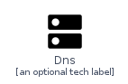
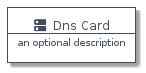
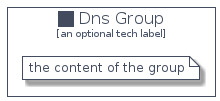

# Dns


```text
homecloud-1/Network/Dns
```

```text
include('homecloud-1/Network/Dns')
```


| Illustration | Dns | DnsCard | DnsGroup |
| :---: | :---: | :---: | :---: |
|  |  |  |  |


## Dns

### Load remotely
```plantuml
@startuml
' configures the library
!global $LIB_BASE_LOCATION="https://github.com/tmorin/plantuml-libs/distribution"

' loads the library's bootstrap
!include $LIB_BASE_LOCATION/bootstrap.puml

' loads the package bootstrap
include('homecloud-1/bootstrap')

' loads the Item which embeds the element Dns
include('homecloud-1/Network/Dns')

' renders the element
Dns('Dns', 'Dns', 'an optional tech label')
@enduml
```

### Load locally
```plantuml
@startuml
' configures the library
!global $INCLUSION_MODE="local"
!global $LIB_BASE_LOCATION="../.."

' loads the library's bootstrap
!include $LIB_BASE_LOCATION/bootstrap.puml

' loads the package bootstrap
include('homecloud-1/bootstrap')

' loads the Item which embeds the element Dns
include('homecloud-1/Network/Dns')

' renders the element
Dns('Dns', 'Dns', 'an optional tech label')
@enduml
```

## DnsCard

### Load remotely
```plantuml
@startuml
' configures the library
!global $LIB_BASE_LOCATION="https://github.com/tmorin/plantuml-libs/distribution"

' loads the library's bootstrap
!include $LIB_BASE_LOCATION/bootstrap.puml

' loads the package bootstrap
include('homecloud-1/bootstrap')

' loads the Item which embeds the element DnsCard
include('homecloud-1/Network/Dns')

' renders the element
DnsCard('DnsCard', 'Dns Card', 'an optional description')
@enduml
```

### Load locally
```plantuml
@startuml
' configures the library
!global $INCLUSION_MODE="local"
!global $LIB_BASE_LOCATION="../.."

' loads the library's bootstrap
!include $LIB_BASE_LOCATION/bootstrap.puml

' loads the package bootstrap
include('homecloud-1/bootstrap')

' loads the Item which embeds the element DnsCard
include('homecloud-1/Network/Dns')

' renders the element
DnsCard('DnsCard', 'Dns Card', 'an optional description')
@enduml
```

## DnsGroup

### Load remotely
```plantuml
@startuml
' configures the library
!global $LIB_BASE_LOCATION="https://github.com/tmorin/plantuml-libs/distribution"

' loads the library's bootstrap
!include $LIB_BASE_LOCATION/bootstrap.puml

' loads the package bootstrap
include('homecloud-1/bootstrap')

' loads the Item which embeds the element DnsGroup
include('homecloud-1/Network/Dns')

' renders the element
DnsGroup('DnsGroup', 'Dns Group', 'an optional tech label') {
    note as note
        the content of the group
    end note
}
@enduml
```

### Load locally
```plantuml
@startuml
' configures the library
!global $INCLUSION_MODE="local"
!global $LIB_BASE_LOCATION="../.."

' loads the library's bootstrap
!include $LIB_BASE_LOCATION/bootstrap.puml

' loads the package bootstrap
include('homecloud-1/bootstrap')

' loads the Item which embeds the element DnsGroup
include('homecloud-1/Network/Dns')

' renders the element
DnsGroup('DnsGroup', 'Dns Group', 'an optional tech label') {
    note as note
        the content of the group
    end note
}
@enduml
```

